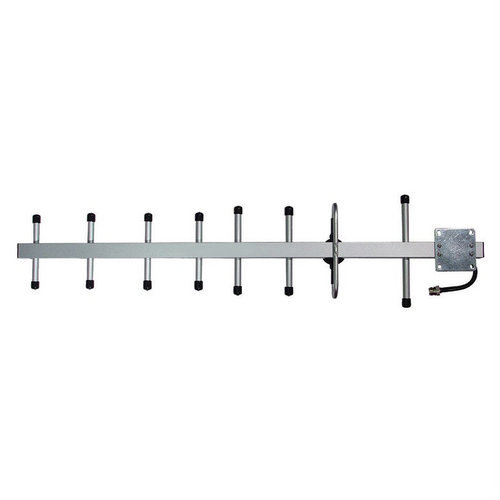

## The UniSat Set

The UniSat is a low cost, ESA standard 1U cubist that meets Industry standards for Educational Satellites, runs on batteries (solar panel can be plugged in and programmitically configured), transmits and receives data through LoRa, has a 3D printed frame, pre-build STEM Payload Board (SB), and can be extended by additional sensors and modules. 

    

<i>The UniSat Set</i>

UniSat Platform is a set of hardware/firmaware + tools for STEM education and scientific and engineering experiments. UniSat Nano-satellite Educational Programme for Girls (aka UNEPG) is founded by [UNICEF Kazakhs](https://unicef.org) organized by Al-Farabi Science Park, is based upon the UniSat Set.

## Hardware Conponents of UniSat Set

    

The Hardware Components of UniSat Set includes :

1. 3D Printed Satellite Frame
2. Aluminum Frame for Flight Missions
3. A
4. B
5. Battery Charger and Charging Cable
6. Camera Module x2 
7. Ground Station
8. Antenna Board
9. STEM Payload Board (Sensor Board)
10. EPS Board
11. OBC + TRX Board (Mission Control and Transmission )
12. TOP Board
13. Battery Board (Power Packet)
14. Antenna Cables x2 (GPS + GSM + LoRa)
15. Screw x3 
16. M3 x YY 
17. External Antenna for Flight Missions (not fit in the picture)
18. User Manual

    

<i>The Yagi Antenna</i>

## OBC General Technical Specifications

| Main Computing Power Provider                   | Memory                     | Physical Interfaces                                          | Network Connection     | Dimensions   |
| ----------------------------------------------- | -------------------------- | ------------------------------------------------------------ | ---------------------- | ------------ |
| Raspberry Pi CM3/CM3 Lite (4C/1.4 Ghz, 1GB RAM) | 4 GB eMMC 64 GB MicroSD/TF | - USB2.0 — 2  - RS485 — 1  - I2C — 1  - CSI — 2  - UART — 1* | WiFi 802.11 b\g\n (KZ) | `10*10*0.46` |

