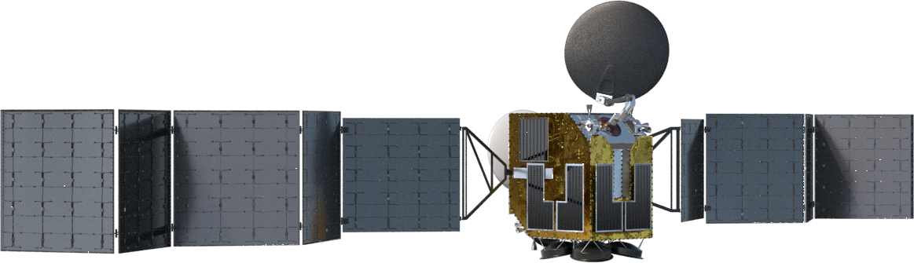

Welcome to the unisat wiki!

UniSat wiki is also availabe in Kazakh, Russian, Uzbek, and Kyrgyz languages.

  

  <h3 align="center">UniSat</h3>

The "UniSat" set and corresponding laboratory equipments, software kit together are a complex STEM-satellite platform designed to teach students the basic principles of developing designing, assembling, testing and operating a spacecraft.

The [United Nations Children's Fund (UNICEF)](https://unicef.org) and [Al-Farabi Kazakh National University (KazNU) ](https://kaznu.kz)launch the second stage of an educational project to develop **UniSat** nanosatellites. Girls from 14 to 25 years old can apply for participation at the online training through this [link.](https://cutt.ly/Xn2FF3y)

**UniSat** is a joint educational programme of UNICEF and Al-Farabi Kazakh National University. Last year, 20 girls developed nanosatellites and launched them into the stratosphere as part of this programme. The launched nanosatellites took pictures of the Earth and collected data on radiation, pressure, gravity, and the composition of light and gas for further analysis by researchers.

20 Girls from different regions of Kazakhstan, launched their nano satellite in 2020

This year, with Dubai Cares support, UNICEF and Al-Farabi KazNU will launch an online course that will cover all regions of Kazakhstan and train more girls. During the course, the programme participants will master the important stages of developing a space vehicle: engineering, design, programming, assembly, testing and launch.

The UniSat goal is to develop the knowledge and competencies of girls in nanosatellite development, and to improve such skills as teamwork, public speaking, time management and creativity.

    

    Nano-satellites

**Nanosatellites** are a class of small space vehicles which do not weigh more than 10 kg. Today, nanosatellites are developed in the world’s leading universities and commercial organizations. UniSat satellites are designed for educational purposes and are equipped with several cameras. One camera shoots an elliptical image of the Earth with 4K resolution.

As part of the partnership between UNICEF and KazNU, girls will receive knowledge from leading experts on aerospace engineering about 3D modeling, design of software control units, software and hardware development skills, communications and the basics of Linux programming.

The **UniSat** educational programme also includes a series of webinars by successful women, experts in various fields of activity, who will share their success stories with the programme participants.

The best graduates of the online programme will be invited to a week-long practical course on assembling a nanosatellite and launching it into the stratosphere.

