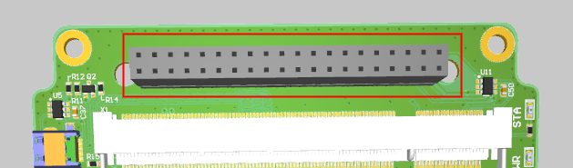

## Introduction

Note: For your better understanding and experience, please consider using [Online 3D Viewer of OBC](https://unepg.github.io/unisat/) ,which might quite useful and always up to date with latest UniSat PCB design.

<p align="center">
    
  <p align="center"><i>UniSat</i></p>
</p>

The on-board computer (hereafter referred to as the OBC) is an integral part of the spacecraft, also the main computing unit of the UniSat. The main load falls on the OBC, and all nodes and subsystems must be controlled, executed algorithms embedded in the On-board computer. In the purpose of education usage, the on-board computer must also perform the functions of an interactive reference document or book, development environment and communication center for the other subsystems.

In addition to those, On board computer (OBC) is the major brain of the satellite, responsible for all core functions, like collecting the system data, logging, error handling, data monitoring, and etc.

Here on the OBC, we have two cameras on OBC, one as a general RPi camera that responsible for capturing beautiful space images while the other is responsible for video recordings.

The capturing task (both imaging and video recording) is a software designed task that runs among almost all the satellite life time in a cycled period.

<p align="center">
    
  <p align="center"><i>Life Cycle of Unisat</i></p>
</p>
In this document,we will introduce all major OBC hardware components one by one.

## UniSat Bus (40 pin)

The first thing you will notice in each and every UniSat subsystem hardware is the 40 Pin Bus. That is how subsystems of the UniSat communicates with each other and get their power from.

<p align="center">
    
  <p align="center"><i>The 40 pin Bus connects all the subsystems</i></p>
</p>

Not all of the 40 pins are connected to the OBC, we can see this clearly from the  [3D PCB View](https://unepg.github.io/unisat/obc.html) .

<p align="center">
    
  <p align="center"><i>The RS485 A/B Lines</i></p>
</p>

As you can see Pin 6 (RS485A) and Pin 8 (RS485B) are connected parallel, and they can be find in every PCB, as we will talk about much in detail later, they are mainly used for communication between different subsystems.

<p align="center">
    
  <p align="center"><i>The I2C Lines</i></p>
</p>

You can also find two pins names as SDA (Pin2) and SCL(Pin4) are connected to the OBC. Using these two lines, gives us the chance to directly communicate and control the sensors on the sensor board (cause we have enough resources on the OBC and it will so much easier for us to program sensors on a Linux device).

<p align="center">
    
  <p align="center"><i>OBC Power Lines</i></p>
</p>

The Pin 10 and Pin 12 together , powers the OBC from EPS. 

<p align="center">
    
  <p align="center"><i>OBC `Busy` Pin</i></p>
</p>

We also have the Busy pin (the pin 1) connected to the OBC and which is mainly used for communication we will talk in detail later.

Here are a complete 40 PIN BUS pinout table:

| RFU  | RFU  | RFU  | 7V4  | 5V   | 3V3  | GND  | GND  | GND  | GND  | GND  | GND  | GND  | GND  | **GND**  | **GND**  | GND         | GND          | INT         | BUSY        |
| ---- | ---- | ---- | ---- | ---- | ---- | ---- | ---- | ---- | ---- | ---- | ---- | ---- | ---- | -------- | -------- | ----------- | ------------ | ----------- | ----------- |
| 39   | 37   | 35   | 33   | 31   | 29   | 27   | 25   | 23   | 21   | 19   | 17   | 15   | 13   | 11       | 9        | 7           | 5            | **3**       | **1**       |
| 40   | 38   | 36   | 34   | 32   | 30   | 28   | 26   | 24   | 22   | 20   | 18   | 16   | 14   | 12       | 10       | 8           | 6            | 4           | 2           |
| RFU  | RFU  | RFU  | 7V4  | 5V   | 3V3  | CH 5 | CH 5 | CH 4 | CH 4 | CH 3 | CH 3 | CH 2 | CH 2 | **CH 1** | **CH 1** | **RS485 B** | **RS485  A** | **I2C SCL** | **I2C SDA** |

And here is the electrical schematics of the Bus:

<p align="center">
    
  <p align="center"><i>UniSat Bus Schematics</i></p>
</p>

## The RPi CM3L and SODIMM Connector

The big connector you can see easily on the OBC PCB is the `SODIMM` connector that designed to hold the Raspberry Pi Compute Module 3+ Lite (or RPi CM3L)

<p align="center">
    
  <p align="center"><i>SODIMM Connector on the OBC</i></p>
</p>

The Raspberry Pi Compute Module 3+ (CM3+) is a range of DDR2-SODIMM-mechanically-compatible
System on Modules (SoMs) containing processor, memory, eMMC Flash (on non-Lite variants) and
supporting power circuitry.[1] These modules allow a designer to leverage the Raspberry Pi hardware and
software stack in their own custom systems and form factors. That's why and how we use it as our main compute resource on the UniSat. 

The CM3+ contains a BCM2837B0 processor (as used on the Raspberry Pi 3B+), 1Gbyte LPDDR2
RAM and eMMC Flash. The CM3+ is currently available in 4 variants, CM3+/8GB, CM3+/16GB,
CM3+/32GB and CM3+ Lite, which have 8, 16 and 32 Gigabytes of eMMC Flash, or no eMMC Flash,
respectively. 

For a system like UniSat, 32GB of space may seem to little and we want extra expansion capability by using the Lite version and replacing a SD card for the eMMC Flash.

In such way, you are free to use and choose any kind of capacity for the disk of RPi.

<p align="center">
    
  <p align="center"><i>CM3+L on OBC</i></p>
</p>

### RPi CM3/CM3+ Features 

#### Hardware

- 2x I2C  (One used for controlling two cameras on OBC, and another one is connected to the I2C lines on Bus to retrieve data from the Sensor-board)
- 1x 4-lane CSI Camera Interface (up to 1Gbps per lane) (Used to connect the Camera 0 on OBC)
- 1x 2-lane CSI Camera Interface (up to 1Gbps per lane) (Used to connect the Camera 1 on OBC)
- 2x UART (As only one of the UART on RPi is ideal to use on CM3L and it is first converted then connected to the RS A/B lines on the UniSat Bus)
- 2x SD/SDIO (Connected to the SD Card interface on OBC)
- 1x HDMI 1.3a (Connected to Micro HDMI Interface on OBC)
- 1x USB2 HOST/OTG (Connected to the USB-HUB, then it connected with 4pin USB headers and Wi-Fi module on OBC)

#### Software

- ARMv8 Instruction Set
- Mature and stable Linux software stack
  - Latest Linux Kernel support
  - Many drivers upstreamed
  - Stable and well supported userland
  - Full availability of GPU functions using standard APIs
  - Stable Debian Based OS for the Satellite

#### CM3 Block Diagram


The CM3 has 200 pins which available through DDR2 (1.8V) SODIMM modules (yet not all of them are connected to the PCB), and connected as shown in the following schematics :


#### Important CM3 Pin assignments  on UniSat OBC

| Pin  | Function | Termination | Description         |
| ---- | -------- | ----------- | ------------------- |
| 0    | input    | pull_up     | *CAMERA 1 I2C0 SDA* |
| 1    | input    | pull_up     | *CAMERA 1 I2C0 SCL* |
| 2    | input    | pull_up     | *SMPS_SCL*          |
| 3    | input    | pull_up     | *SMPS_SDA*          |
| 14   | uart0    | no_pulling  | *TX uart0*          |
| 15   | uart0    | pull_up     | *RX uart0*          |
| 28   | input    | pull_up     | *CAMERA 0 I2C0 SDA* |
| 29   | input    | pull_up     | *CAMERA 0 I2C0 SCL* |
| 36   | output   | pull_up     | *WIFI DIS*          |
| 40   | output   | pull_up     | *HAB RESET*         |
| 46   | input    | no_pulling  | *Hot-plug*          |
| 47   | output   | no_pulling  | *EMMC_ENABLE_N*     |
| 48   | sdcard   | pull_up     | *SD CLK*            |
| 49   | sdcard   | pull_up     | *SD CMD*            |
| 50   | sdcard   | pull_up     | *SD D0*             |
| 51   | sdcard   | pull_up     | *SD D1*             |
| 52   | sdcard   | pull_up     | *SD D2*             |
| 53   | sdcard   | pull_up     | *SD D3*             |

#### Device tree source (DTS) file sample for driving the CM3 on UniSat OBC

```dtd
/dts-v1/;

/ {
  videocore {

    pins_cm3 {

      pin_config {

        pin@default {
          polarity = "active_high";
          termination = "pull_down";
          startup_state = "inactive";
          function = "input";
        }; // pin

        pin@p0  { function = "input";  	termination = "pull_up";    }; // CAMERA 1 I2C0 SDA
        pin@p1  { function = "input";  	termination = "pull_up";    }; // CAMERA 1 I2C0 SCL
		
        pin@p2 { function = "input";  	termination = "pull_up";    }; // SMPS_SCL
        pin@p3 { function = "input";  	termination = "pull_up";    }; // SMPS_SDA

        pin@p14 { function = "uart0";  	termination = "no_pulling"; drive_strength_mA = < 8 >; }; // TX uart0
        pin@p15 { function = "uart0";  	termination = "pull_up";    drive_strength_mA = < 8 >; }; // RX uart0
		
        pin@p28 { function = "input";  	termination = "pull_up";    }; // CAMERA 0 I2C0 SDA
        pin@p29 { function = "input";  	termination = "pull_up";    }; // CAMERA 0 I2C0 SCL
		
	pin@p36 { function = "output";	termination = "pull_up"; startup_state = "inactive";	}; 				// WIFI DIS
	pin@p40	{ function = "output"; 	termination = "pull_up"; polarity = "active_low"; startup_state = "inactive"; };	// HAB RESET

        pin@p42  { function = "output"; termination = "no_pulling"; }; 	// CAMERA 0 LED
        pin@p43  { function = "output"; termination = "no_pulling"; }; 	// CAMERA 0 SHUTDOWN
        pin@p44 { function = "output"; 	termination = "no_pulling"; };	// CAMERA 1 LED
        pin@p45 { function = "output"; 	termination = "no_pulling"; };	// CAMERA 1 SHUTDOWN
		
        pin@p46 { function = "input";  termination = "no_pulling"; polarity = "active_low"; }; // Hotplug
        pin@p47 { function = "output"; termination = "no_pulling"; polarity = "active_low"; }; // EMMC_ENABLE_N
	pin@p48 { function = "sdcard"; 	termination = "pull_up";    drive_strength_mA = < 8 >; }; // SD CLK
        pin@p49 { function = "sdcard"; 	termination = "pull_up";    drive_strength_mA = < 8 >; }; // SD CMD
        pin@p50 { function = "sdcard"; 	termination = "pull_up";    drive_strength_mA = < 8 >; }; // SD D0
        pin@p51 { function = "sdcard"; 	termination = "pull_up";    drive_strength_mA = < 8 >; }; // SD D1
        pin@p52 { function = "sdcard"; 	termination = "pull_up";    drive_strength_mA = < 8 >; }; // SD D2
        pin@p53 { function = "sdcard"; 	termination = "pull_up";    drive_strength_mA = < 8 >; }; // SD D3

      }; // pin_config

      pin_defines {
        pin_define@HDMI_CONTROL_ATTACHED 	{ type = "external"; number = <0>; };
        pin_define@EMMC_ENABLE 				{ type = "external"; number = <1>; };
        pin_define@POWER_LOW 				{ type = "absent"; };
        pin_define@LEDS_DISK_ACTIVITY 		{ type = "absent"; };
        pin_define@LAN_RUN 					{ type = "absent"; };
        pin_define@SMPS_SDA 				{ type = "internal"; number = <2>; };
        pin_define@SMPS_SCL 				{ type = "internal"; number = <3>; };
        pin_define@ETH_CLK 					{ type = "absent"; };
        pin_define@WL_LPO_CLK 				{ type = "absent"; };
        pin_define@USB_LIMIT_1A2 			{ type = "absent"; };
        pin_define@SIO_1V8_SEL 				{ type = "absent"; };
        pin_define@PWML 					{ type = "absent"; };
        pin_define@PWMR 					{ type = "absent"; };
        pin_define@SAFE_MODE 				{ type = "absent"; };
        pin_define@SD_CARD_DETECT 			{ type = "absent"; };
        pin_define@ID_SDA 					{ type = "absent"; };
        pin_define@ID_SCL 					{ type = "absent"; };

        pin_define@NUM_CAMERAS 				{ type = "internal"; number = <2>; };
        pin_define@CAMERA_0_LED 			{ type = "internal"; number = <42>; };
        pin_define@CAMERA_0_SHUTDOWN 		{ type = "internal"; number = <43>; };
        pin_define@CAMERA_0_UNICAM_PORT 	{ type = "internal"; number = <0>; };
        pin_define@CAMERA_0_I2C_PORT 		{ type = "internal"; number = <0>; };
        pin_define@CAMERA_0_SDA_PIN 		{ type = "internal"; number = <28>; };
        pin_define@CAMERA_0_SCL_PIN 		{ type = "internal"; number = <29>; };
        pin_define@CAMERA_1_LED 			{ type = "internal"; number = <44>; };
        pin_define@CAMERA_1_SHUTDOWN 		{ type = "internal"; number = <45>; };
        pin_define@CAMERA_1_UNICAM_PORT 	{ type = "internal"; number = <1>; };
        pin_define@CAMERA_1_I2C_PORT 		{ type = "internal"; number = <0>; };
        pin_define@CAMERA_1_SDA_PIN 		{ type = "internal"; number = <0>; };
        pin_define@CAMERA_1_SCL_PIN 		{ type = "internal"; number = <1>; };
      }; // pin_defines

    }; // pins_cm3

  };

};

```

Note: Please refer to the software section of the documentation for much more detailed information about OBC RPi.

## Cameras on the OBC

OBC comes with two different camera modules in total, and they are different both in shape and functions.

#### Cam0

The cam0 on the UniSat, connected to the OBC, is 5MP 175 Degree Wide Angle Fisheye Lens Raspberry Pi Camera Module OV5647. Which is usually located on the bottom of the spacecraft so that it may took beautiful pictures of the earth from the space. 

<p align="center">
    
  <p align="center"><i>Fish Eye Camera on the OBC</i></p>
</p>

Main specifications of the camera 0:

- **Sensor type: OV5647** 
- **Resolution:2592 x 1944**
- **Lens: f=3.6 mm, f/2.9**
- **FOV: 175 degrees**
- **Object distace: 5cm to infinity**
- **Video frame rate: 1080p at 30 fps with codec H.264 (AVC)** (**Up to 90 fps Video at VGA**)
- **500 million pixels**

#### Cam1

<p align="center">
    
  <p align="center"><i> Camera 1 on the OBC</i></p>
</p>

The camera 1 on the OBC is a standard raspberry pi camera module, and comes with specifications as below:

- **Sony IMX219 sensor**
- **8-megapixel**
- **supports 1080p30, 720p60 and VGA90 video modes**

## Other main hardware components of the OBC

The OBC comes with other hardware components such as two 4pin USB hub for connecting your other USB slave devices, Micro HDMI for connecting to external displays, A micro SD card slot for using with TF (Micro SD card). You may refer to the OBC schematics and PCB for detailed information about them.

