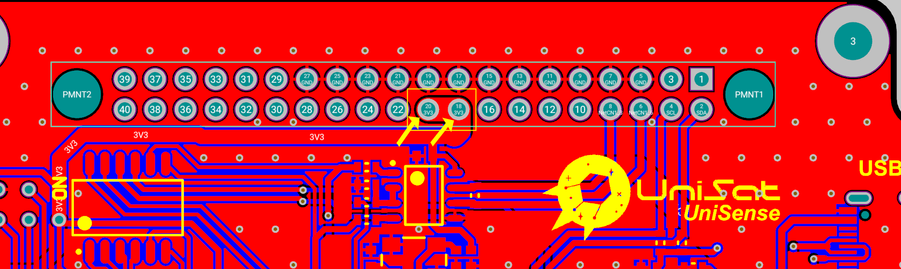

Атау көрсеткендей, датчик тақтасы-бұл датчик деректерін оқуға (немесе жауап беруге) жауап беретін бөлік.

Ескерту: Сіз жақсы түсіну және тәжірибе алу үшін [OBC 3D  онлайн қараңыз](https://unepg.github.io/unisat /), бұл өте пайдалы және әрқашан UniSat -тың  соңғы платасының әзірлемелерінен хабардар бола аласыз.

##  SB құрылғысын талдау

<p align="center">
    
  <p align="center"><i> Unisat датчигінің платасы (3D)</i></p>
</p>


Суретте оңай көрініп тұрғандай, SB бірнеше негізгі бөліктер мен компоненттерді қамтиды және олар :

-  UniSat Шинасы  (40 істікшелі)
- 6 түйіндерді алмастырғыш
- STM32L0
- Arduino Pro Mini 3V
- SI1145 
- BME680
- BNO055 
-  Гейгер есептеуіші
-  USB -C  қосқышы (ПК -да Arduino-ны бағдарламалау үшін )
- 4 істікшелі USB қосқыш
- 4 істікшелі i2c қосқыш

Бізде OBC сияқты 40 істікшелі қосқыш бар, бірақ SB-де олар сәл басқаша қосылған.

Біз OBC-ді 10 және 12 шығыстарымен  (1-арна) қосқан кезде, суретте көрсетілгендей SB-ны 18 және 20 (3-арна) шығыстарымен қосамыз:

<p align="center">
    
  <p align="center"><i>40 істікшелі коннектордағы 3-арна SB қуат көзі үшін қолданылады </i></p>
</p>

Төменде көрсетілгендей I2C шинасына қосылуды қамтамасыз ету үшін 2 (SDA) және 4 (SCL) шығысы қолданылады (ол  содан кейін әдетте OBC-де RPi қосылады және қолданылады):


<p align="center">
    
  <p align="center"><i>    SB - дағы I2C желілері</i></p>
</p>

SB-ге қосылған контактілердің соңғы маңызды жұбы-ішкі жүйелер арасында қосылу үшін қолданылатын RS485 контактілері:

<p align="center">
    
  <p align="center"><i>SB-дегі RS485 желілері</i></p>
</p>


## SB -дағы MCU 

### STM32

Бізде UniSat SB-де екі түрлі микроконтроллер бар, олар STM32 және Arduino, сіз екеуін де әртүрлі тапсырмалар үшін қолдана аласыз, бірақ бір уақытта емес.

SB-дегі  STM32-бұл ST микроконтроллерлеріндегі ARM® Cortex® - M0+ негізінде ультра төмен қуатты 32 биттік STM32L073RZT6 микроконтроллері болып табылады.

SB-де STM32 ерекшеліктері:

- Өте төмен қуатты платформа

- Ядро : Arm® 32-bit Cortex®-M0+ с MPU

- 192-Кбайт  ECC дағы флэш-жады 

- 20-Kбайт RAM

- ECC -дан  6 Кбайт  EEPROM деректері 

- 20-байттық резервті регистр

-  R/W операцияларынан сектордың қауіпсіздігі

- USART рұқсатталған  ( RS485 желілеріне қосылған )

- Сериялық сымды жөндеуге қолдау көрсетіледі

  <p align="center">
      
    <p align="center"><i>SB-де сериялық сымды түзеткіш контактілер</i></p>
  </p>

- 7-арналы  DMA контроллері  ( UART  үшін қолданылады и  I2C -мен қолданылу үшін бағдарламалануы мүмкін)

-   MCU-дағы  I2C UniSat шинасына және  I2C датчигіне қосылған.

- 11x таймерлер : 2x 16-разрядты  4 арнаға дейінгі , 2x 16-разрядты 2 арнаға дейінгі , ультра төмен энергеия тұтынатын 1x 16-разрядты таймер , 1x SysTick, 1x RTC, САТ және  2 Watchdog үшін  2x 16-разрядты негізгі  (тәуелсіз /терезелік)

Ескерту: STM32-де UniSat бағдарламалық жасақтамасын әзірлеу үшін бағдарламалық жасақтаманы әзірлеу бөліміне назар аударыңыз.

### Ардуино

SB-дегі Arduino-8 биттік 20 МГц 32 КБ (16 К x 16) FLASH 32-TQFP (7x7) бар AVR сериялы микроконтроллер микросызбасы.

Arduino платформасындағы ресурстардың негізгі шектеулеріне байланысты сіз оны негізгі MCU/MPU үшін нақты сынақтар мен ұшулар үшін пайдаланбауыңыз мүмкін, бірақ бұл платада әзірлеу үшін жақсы , өйткені arduino -ны OBC RPi-ге  немесе SB-де  STM32  -ге  қарағанда пайдалану және игеру әлдеқайда оңай.

SB-де Arduino чипінің ерекшеліктері:

- Өнімділігі жоғары ,  8-разрядты AVR® микроконтроллерлер арасындағы аз қуаттысы
- 32 x 8 жалпы мақсаттағы жұмыс регистрі
- 16 ГБ кіріктірілген өзінен-өзі бағдарламаланатын флэш-жад
- 1Kбайт EEPROM
- 2 Кбайт RAM ішкі жадысы
- Бағдарламаланатын сериялық UART (шинадағы RS485 желілеріне қосылған)
- I2C MCU-дан  I2C датчиктеріне  және Uni SAT шинасына қосылған.

Сілтеие : [ Ерекшеліктер](https://ww1.microchip.com/downloads/en/DeviceDoc/ATmega48A-PA-88A-PA-168A-PA-328-P-DS-DS40002061B.pdf)

## SB-дағы датчиктер

### SI1145 - ЖАҚЫНДАУ ДАТЧИГІНІҢ МИКРОСЫЗБАСЫ/УК/I2C ИНТЕРФЕЙСІ БАР IC ТАРАЛҒАН ЖАРЫҚ ДАТЧИГІНІҢ МИКРОСЫЗБАСЫ 

Si 1145/46/47-бұл төмен қуатты, шағылысуға негізделген инфрақызыл жақындау датчигі, ультракүлгін (УК) индексі және I2C сандық интерфейсі бар және оқиғаларды үзілуі бағдарламаланатын шығысы бар жарық датчигі. Бұл контактісіз датчик микросхемасына аналогты сандық түрлендіргіш, жоғары сезімталдық көрінетін және инфрақызыл фотодиодтар, сандық сигнал процессоры және он бес таңдалған жетек деңгейлері бар бір, екі немесе үш кіріктірілген инфрақызыл жарықдиодты драйверлер кіреді. Si 1145/46/47 кең динамикалық диапазонда және әр түрлі жарық көздерінде, соның ішінде тікелей күн сәулесінде керемет өнімділікті қамтамасыз етеді.

#### Істікшелердің қолданыстары

<p align="center">
    
  <p align="center"><i> SI1145-да істікшелердің қолданыстары</i></p>
</p>


#### SB орналасуы 

<p align="center">
    
  <p align="center"><i>  SI1145 сызбасы  </i></p>
</p>


#### Шашырау сәулесі

Si1145/46/47 көрінетін және инфрақызыл сәулелерді өлшеуге қабілетті фотодиодтармен жабдықталған. Алайда, көрінетін фотодиодқа инфрақызыл жарық әсер етеді (USK UniSat-та `ir` деп белгіленген).

Жарықтандыруды өлшеу үшін адамның көзімен бірдей спектрлік жауап қажет. Егер люксті дәл өлшеу қажет болса, көрінетін жарықтың фотодиодының қосымша ИҚ сипаттамасын өтеу қажет. Сонымен, хостқа инфрақызыл жарықтың әсеріне түзетулер енгізуге мүмкіндік беру үшін Si1145/46/47 инфрақызыл жарықтың жеке арна арқылы өлшенгені туралы хабарлайды. 

Жеке көрінетін және ИҚ фотодиодтары әртүрлі алгоритмдік шешімдерге сәйкес келеді. Содан кейін хост осы екі өлшемді орындай алады және алгоритмді адамның көзімен қабылданатын эквивалентті люкс деңгейін алу үшін іске қосады. Хостта жұмыс істейтін түзету алгоритмінің болуы жүйеге тәуелді айнымалыларды орнатудың максималды икемділігін қамтамасыз етеді. Мысалы, егер жүйеде қолданылатын әйнек инфрақызыл сәуледен гөрі көрінетін жарықты бұғаттаса, оларды түзету керек.

#### Ультракүлгін  (УКИ) индекс

- УКИ-ультракүлгін сәулелену деңгейінің көрсеткіші.

- Индекс мәндері нөлден жоғары қарай өзгереді- УКИ неғұрлым жоғары болса, терінің және көздің зақымдану ықтималдығы соғұрлым жоғары болады және сәйкесінше зиян келтіруге аз уақыт кетеді.
- УКИ- адамдарға күнге қарсы  қорғану құралдарын қолдану қажеттілігі туралы ескертудің маңызды құралы

> Бүкіл әлемде  ашық реңді  адамдар арасында тері қатерлі ісігінің айтарлықтай өсуі күннің ультракүлгін сәулелесінің шамадан тыс өсуіне  және жасанды күнге қыздырыну  құралдарына , мысалы, арнайы жабдықтарға   байланысты. Қазіргі заманғы дәлелдерге сүйенсек  күн сәулесінің астында жүруді әдеті  ультракүлгін сәулеленудің зақымдауының  маңызды факторы болып табылады.
>
> УКИ- сәулеленудің шамадан тыс әсер ету қаупі туралы халықтың хабардарлығын арттырудың және адамдарға қорғаныс шараларын қолдану қажеттілігі туралы ескертудің маңызды құралы болып табылады. Дүниежүзілік денсаулық сақтау ұйымының халықаралық қолдауымен Біріккен Ұлттар Ұйымының Қоршаған ортаны қорғау бағдарламасы және Дүниежүзілік метеорологиялық ұйым УКИ жасап шығарды. Адамдарды күн сәулесінің әсерін азайтуға ынталандыру денсаулыққа зиянды әсерін азайтып, денсаулық сақтау шығындарын едәуір төмендетеді.

– Дүниежүзілік Денсаулық Сақтау Ұйымынан

<p align="center">
    
  <p align="center"><i>УК-индекс (ДЖ Денсаулық Сақтау Ұйымынан алынған)</i></p>
</p>


SB-де SI1145 әдетте үш мәнді қайтарады: 

- vis – көрінетін жарық 
- ir – инфра жарық
- `uv` - УКИ

Қайтару мәндерінің мысалы (UDC CC-дегі json сияқты) :

```json
{
  "id": 8,
  "updated": "2021-11-05T14:33:26.119497",
  "vis": 0,
  "ir": 253,
  "uv": 2
}
```

####  I2C интерфесі 

Si1145 I2C мекен-жайы **0x60** тең .Si 1145/46/47 сонымен қатар ғаламдық мекен-жайға (0x00) және ғаламдық қалпына келтіру командасына (0x06) жауап береді. Тек 7 биттік I2C адрестеуге қолдау көрсетіледі; 10 биттік I2C адрестеуге қолдау көрсетілмейді. Тұжырымдамалық тұрғыдан алғанда, I2C интерфейсі SI1145/46/47 ішкі регистрлеріне қол жетімділікті қамтамасыз етеді.


<p align='center'><i>I2C биттерінің уақыттық диаграммасы </i></p>

I2C жазбасына кіру әрқашан іске қосу (немесе қайта іске қосу) жағдайынан басталады. Іске қосу шартынан кейінгі бірінші байт - бұл I2C мекен-жайы және оқу-жазу биті. Екінші байт Si 1145/46/47 ішкі регистрінің бастапқы мекен-жайын анықтайды. Келесі байттар SI1145/46/47 ішкі регистріне тоқтату шарты пайда болғанға дейін дәйекті түрде жазылады.I2C оқуға дайындық кезінде  SI1145/46/47 ішкі мекен-жайын орнату үшін I2C жазуға тек екі байт қол жетімділік қолданылады.

<p align="center">
    
  <p align="center"><i>Бір жазбаks  хост интерфейсі</i></p>
</p>

I2C оқуға қол жетімділік, сондай-ақ I2C жазуға қол жетімділік іске қосу немесе қайта іске қосу жағдайынан басталады. I2C оқу кезінде I2C шебері SI 1145/46/47 I2C ішкі регистр мазмұнымен басқаруға мүмкіндік беру үшін SCK синхрондауды жалғастырады. Si 1145/46/47 сонымен қатар пакеттік оқу мен пакеттік жазуды қолдайды. Пакеттерді оқу үздіксіз тізбектелген регистрлерді жинау кезінде пайдалы. Si 1145/46/47 Регистр картасы үзіліс өңдегіштері үшін пакеттік оқуды оңтайландыруға арналған, ал пакеттік жазба жиі қолданылатын өрістерді жылдам бағдарламалауды жеңілдетуге арналған.

<p align="center">
    
  <p align="center"><i>Бір оқылуға арналған хост интерфейсі</i></p>
</p>


Ескертпелер:

- Сұр жәшіктер хост арқылы Si1145-ке жіберіледі
- Ақ жәшіктер si1145 хостқа беріледі
- A = ACK немесе “acknowledge”
- N = NACK немесе “no acknowledge”
- S = START күйі
- Sr = repeat START күйі
- P = STOP күйі

### BME680 - салыстырмалы ылғалдылықты, барометрлік қысымды, қоршаған орта температурасын және газды өлшейтін газ сенсоры .

BME680-бұл жоғары дәлдіктегі және сызықты газ, қысым, ылғалдылық және температура датчиктерін біріктіретін газ датчигі. 

Біздің жағдайда, SB-дегі BME680 температура, қысым және ылғалдылықтың негізгі көзі ретінде жұмыс істейді.

SB-дегі BME680 сенсорлардың ортасында орналасқан және I2C интерфейсі арқылы микроконтроллерлер мен I2C шиналарына қосылған.

<p align="center">
    
  <p align="center"><i>SB дағы  BME680 </i></p>
</p>

Баспа тақтасында `meteo sensor` деп белгіленген, сіз оның өте кішкентай, бірақ күшті екенін байқайсыз.

```json
{
  "id": 22,
  "updated": "2021-11-05T14:33:12.284962",
  "temperature": 30.42,
  "pressure": 935.33,
  "humidity": 8.6
}
```

### BNO055-акселерометрді, гироскопты, магнитометрді және бағдарды біріктіретін ақылды датчик

BNO055 ақылды сенсоры-бұл үш осьті 14 биттік акселерометрді , дәл үш осьті 16 биттік жабық  контурлы гироскопты, үш осьті геомагниттік датчикті  және BSX3.0 FusionLib бағдарламалық жасақтамасы бар 32 биттік микроконтроллерді біріктіретін пакеттік жүйе .

UniSat-та ол төменде көрсетілгендей егжей-тегжейлі телеметрияны қайтарады:

```json
{
  "id": 7,
  "updated": "2021-11-05T14:33:19.170418",
  "temperature": 30,
  "acceleration": {
    "id": 7,
    "bno_id": 7,
    "x": 1.58,
    "y": 0.5,
    "z": 9.67
  },
  "magnetic": {
    "id": 7,
    "bno_id": 7,
    "x": 47.75,
    "y": -19.375,
    "z": -60.5625
  },
  "gyro": {
    "id": 7,
    "bno_id": 7,
    "x": -0.004363323129985824,
    "y": -0.003272492347489368,
    "z": -0.003272492347489368
  },
  "euler": {
    "id": 7,
    "bno_id": 7,
    "x": 0,
    "y": 0,
    "z": 0
  },
  "quaternion": {
    "id": 7,
    "bno_id": 7,
    "w": 0.0078125,
    "x": 0,
    "y": 0,
    "z": 0
  },
  "linear_acceleration": {
    "id": 7,
    "bno_id": 7,
    "x": 0,
    "y": 0,
    "z": 0
  },
  "gravity": {
    "id": 7,
    "bno_id": 7,
    "x": 0,
    "y": 0,
    "z": 0
  }
}
```


Сіз BNO055-ті көптеген тапсырмалар мен деректерді талдау үшін пайдалана аласыз.

SI1145 бөлімінде I2C интерфейсін пайдалану туралы бұрын айтқанымыздай, біз оны осы тақырыпты қалдырамыз . Датчиктер туралы қосымша ақпарат алу үшін сіз USK веб-сайтындағы бағдарламалық жасақтама құжаттамасына жүгіне аласыз.

#### Гейгер есептеуіші 

ЕСКЕРТУ: ГЕЙГЕР ЕСЕПТЕГІШІ ЕСКІРЕДІ.

