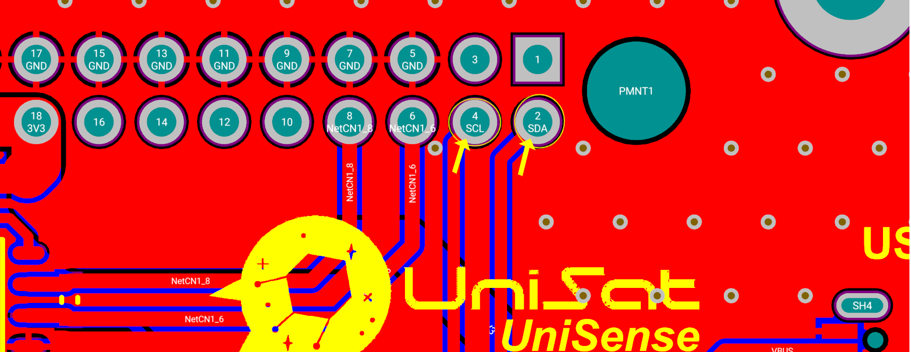
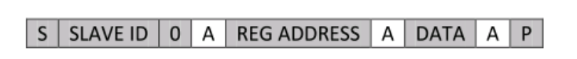

Как видно из названия, плата датчика - это часть, которая отвечает за считывание (или реагирование) данных датчика.

Примечание: Для вашего лучшего понимания и опыта, пожалуйста, рассмотрите возможность использования [Онлайн-3D-просмотра SB](https://unepg.github.io/unisat /), что может быть весьма полезно и чтобы быть всегда в курсе последних разработок печатных плат UniSat.

## Обзор оборудования SB

<p align="center">
    
  <p align="center"><i>Плата датчика Unisat (3D)</i></p>
</p>


Как вы можете легко видеть на рисунке, SB включает в себя несколько основных частей и компонентов, и они :

- Шина UniSat  (40 контакта)
- 6 переключатель узлов
- STM32L0
- Arduino Pro Mini 3V
- SI1145 
- BME680
- BNO055 
- Счетчик Гейгера
- Соединитель USB -C  (Для программирования Arduino с ПК)
- 4 контактный USB соединитель 
- 4 контактный i2c соединитель

Хотя у нас есть 40-контактный разъем, как и на OBC , на SB они подключены немного по-другому.

В то время как мы подключили OBC с помощью выводов 10 и 12 (канал 1), мы подключаем SB с помощью выводов 18 и 20 (канал 3), как показано на рисунке:

<p align="center">
    
  <p align="center"><i>3-канал на 40-контактном разъеме используется для питания SB </i></p>
</p>

Вывод 2 (SDA) и вывод 4 (SCL) используются для обеспечения подключения i2c к ШИНЕ. (который обычно затем подключается и используется RPi на OBC), как показано ниже:

<p align="center">
    
  <p align="center"><i> Линии I2C в SB</i></p>
</p>

Последняя важная пара контактов, подключенных к SB, - это контакты RS485, используемые для подключения между подсистемами:

<p align="center">
    
  <p align="center"><i> Линии RS485 в SB</i></p>
</p>

## MCU на SB

### STM32

У нас есть два разных микроконтроллера на UniSat SB, это STM32 и Arduino, вы можете использовать их оба либо для разных задач, но не одновременно.

STM32 на SB представляет собой 32-разрядный микроконтроллер STM32L073RZT6 с ультранизким энергопотреблением на базе ARM® Cortex®-M0+ от микроконтроллеров ST.

Особенности STM32 на SB:

- Платформа со сверхнизким энергопотреблением

- Ядро : Arm® 32-bit Cortex®-M0+ с MPU

- 192-Кбайт флэш-памяти с ECC

- 20-Kбайт RAM

- 6 Кбайт данных EEPROM с ECC

- 20-байтовый резервный регистр

- Защита сектора от R/W операций

- Поддерживается USART (подключен к линиям RS485)

- Поддерживается отладка последовательного провода

  <p align="center">
      
    <p align="center"><i>Контакты отладчика последовательного провода на SB</i></p>
  </p>

- 7-канальный контроллер DMA (используется для UART и может быть настроен для использования с I2C)

-  I2C from MCU connected to the I2C sensors and the UniSat BUS.

- 11x таймеры: 2x 16-разрядный до 4 каналов, 2x 16-разрядный до 2 каналов, 1x 16-разрядный таймер с ультранизким энергопотреблением, 1x SysTick, 1x RTC, 2x 16-разрядный базовый для ЦАП и 2 Watchdog (независимый/оконный)

Примечание: Пожалуйста, обратите внимание к части разработки программного обеспечения для разработки программного обеспечения UniSat на STM32.

### Ардуино

Arduino на SB представляет собой микросхему микроконтроллера серии AVR с 8-разрядной 20 МГц 32 КБ (16 К x 16) FLASH 32-TQFP (7x7).

Из-за основных ограничений ресурсов платформы на Arduino вы можете не использовать его для своего основного MCU/MPU для реальных испытаний и полетов, но это хороший профессионал для разработки на плате, потому что arduino намного проще в использовании и освоении, чем RPi на OBC или STM32 на SB.

Особенности микросхемы Arduino на SB:

- Высокопроизводительное, маломощное в семействе 8-разрядных микроконтроллеров AVR®
- 32 x 8 Рабочих регистров общего назначения
- 16 Кбайт встроенной самопрограммируемой флэш-памяти
- 1Kбайт EEPROM
- 2 Кбайта внутренней памяти SRAM
- Программируемый последовательный USART (подключен к линиям RS485 на ШИНЕ)
- I2C от MCU подключен к датчикам I2C и шине UniSat.

Сссылка : [ Спецификация](https://ww1.microchip.com/downloads/en/DeviceDoc/ATmega48A-PA-88A-PA-168A-PA-328-P-DS-DS40002061B.pdf)

## Датчики на  SB

### SI1145 - МИКРОСХЕМА ДАТЧИКА ПРИБЛИЖЕНИЯ/УФ/МИКРОСХЕМА ДАТЧИКА IC РАССЕЯННОГО СВЕТА С ИНТЕРФЕЙСОМ I2C

Si1145/46/47 - это маломощный, основанный на отражении, инфракрасный датчик приближения, ультрафиолетовый (УФ) индекс и датчик окружающего света с цифровым интерфейсом I2C и программируемым выходом прерывания событий. Эта бесконтактная сенсорная микросхема включает в себя аналого-цифровой преобразователь, встроенные высокочувствительные видимые и инфракрасные фотодиоды, цифровой сигнальный процессор и один, два или три встроенных драйвера инфракрасных светодиодов с пятнадцатью выбираемыми уровнями привода. Si1145/46/47 обеспечивает отличную производительность в широком динамическом диапазоне и при различных источниках света, включая прямой солнечный свет.

#### Назначения Пинов

<p align="center">
    
  <p align="center"><i>Назначения Пинов в SI1145</i></p>
</p>


#### Размещение SB

<p align="center">
    
  <p align="center"><i> Схемы SI1145 </i></p>
</p>


#### Рассеянный свет

Si1145/46/47 оснащен фотодиодами, способными измерять как видимый, так и инфракрасный свет. Однако на видимый фотодиод также влияет инфракрасный свет (обозначенный как  `ir`  на USK UniSat).

Для измерения освещенности требуется тот же спектральный отклик, что и для человеческого глаза. Если требуется точное измерение люкса, необходимо компенсировать дополнительную ИК-характеристику фотодиода видимого света. Поэтому, чтобы позволить хосту вносить поправки в влияние инфракрасного света, Si1145/46/47 сообщает об измерении инфракрасного света по отдельному каналу. Отдельные видимые и ИК-фотодиоды подходят для различных алгоритмических решений. Затем хост может выполнить эти два измерения и запустить алгоритм для получения эквивалентного уровня люкса, воспринимаемого человеческим глазом. Наличие их алгоритма коррекции, запущенного на хосте, обеспечивает максимальную гибкость в настройке для системно-зависимых переменных. Например, если стекло, используемое в системе, блокирует видимый свет больше, чем инфракрасный, их коррекцию необходимо скорректировать.

#### Ультрафиолетовый (УФ) индекс

- УФИ это показатель уровня ультрафиолетового излучения.
- Значения индекса варьируются от нуля вверх - чем выше УФИ, тем больше вероятность повреждения кожи и глаз и тем меньше времени требуется для нанесения вреда.
- УФИ является важным средством оповещения людей о необходимости использования средств защиты от солнца

> Заметный рост заболеваемости раком кожи среди светлокожих людей во всем мире тесно связан с чрезмерным воздействием ультрафиолетового излучения солнца и, возможно, искусственных источников, таких как оборудовании для загара. Современные данные свидетельствуют о том, что личные привычки в отношении пребывания на солнце являются наиболее важным индивидуальным фактором риска повреждения ультрафиолетовым излучением.
>
> УФИ  является важным средством повышения осведомленности общественности о рисках чрезмерного воздействия ультрафиолетового излучения и предупреждения людей о необходимости принятия защитных мер. В рамках международных усилий ВОЗ, Программа Организации Объединенных Наций по окружающей среде и Всемирная метеорологическая организация разработали УФИ. Поощрение людей к сокращению пребывания на солнце может уменьшить вредные последствия для здоровья и значительно снизить расходы на здравоохранение

– От Всемирной Организации Здравоохранения

<p align="center">
    
  <p align="center"><i>УФ-индекс (взято: ВОЗ)</i></p>
</p>


SI1145 на SB обычно возвращает три значения: 

- vis – видимый свет 
- ir – инфра свет
- `uv` - УФИ

Пример возвращаемых значений (как json из UDC CC) :

```json
{
  "id": 8,
  "updated": "2021-11-05T14:33:26.119497",
  "vis": 0,
  "ir": 253,
  "uv": 2
}
```

####  Интерфейс I2C

Ведомый адрес Si1145 I2C равен **0x60**. Si1145/46/47 также реагирует на глобальный адрес (0x00) и команду глобального сброса (0x06). Поддерживается только 7-разрядная адресация I2C; 10-разрядная адресация I2C не поддерживается. Концептуально интерфейс I2C обеспечивает доступ к внутренним регистрам Si1145/46/47.


<p align='center'><i>Временная диаграмма битов I2C </i></p>

Доступ на запись I2C всегда начинается с условия запуска (или перезапуска). Первый байт после условия запуска - это адрес I2C и бит чтения-записи. Второй байт задает начальный адрес внутреннего регистра Si1145/46/47. Последующие байты записываются во внутренний регистр Si1145/46/47 последовательно до тех пор, пока не возникнет условие остановки. Доступ для записи I2C всего с двумя байтами обычно используется для настройки внутреннего адреса Si1145/46/47 при подготовке к чтению I2C.

<p align="center">
    
  <p align="center"><i>Интерфейс Хоста с одной записью</i></p>
</p>


Доступ для чтения I2C, как и доступ для записи I2C, начинается с условия запуска или перезапуска. При чтении I2C мастер I2C затем продолжает синхронизировать SCK, чтобы позволить Si1145/46/47 управлять I2C с содержимым внутреннего регистра. Si1145/46/47 также поддерживает пакетное чтение и пакетную запись. Считывание пакетов полезно при сборе непрерывных последовательных регистров. Карта регистров Si1145/46/47 была разработана для оптимизации пакетного чтения для обработчиков прерываний, а пакетная запись предназначена для облегчения быстрого программирования часто используемых полей.

<p align="center">
    
  <p align="center"><i>Интерфейс хоста для одного чтения</i></p>
</p>


Примечание: 

- Серые ящики передаются хостом на Si1145
- Белые ящики передаются Si1145 на хост
- A = ACK или  “acknowledge”
- N = NACK или “no acknowledge”
- S = состояние START 
- Sr =  состояние repeat START 
- P =  состояние STOP


### BME680 - Газовый датчик, измеряющий относительную влажность, барометрическое давление, температуру окружающей среды и газ .

BME680 - это газовый датчик, который объединяет высокоточные и линейные датчики газа, давления, влажности и температуры. 

В нашем случае BME680 на SB работает как основной источник температуры, давления и влажности.

BME680 на SB расположен в середине датчиков и подключен к микроконтроллерам и шине I2C через интерфейс I2C.

<p align="center">
    
  <p align="center"><i>BME680 в SB</i></p>
</p>

Обозначенный на печатной плате как `meteo sensor`, вам покажется он очень маленьким, но мощным.

```json
{
  "id": 22,
  "updated": "2021-11-05T14:33:12.284962",
  "temperature": 30.42,
  "pressure": 935.33,
  "humidity": 8.6
}
```

### BNO055 - Интеллектуальный датчик, объединяющий акселерометр, гироскоп, магнитометр и ориентацию

Интеллектуальный датчик BNO055 представляет собой систему в пакете , которая объединяет трехосный 14-разрядный акселерометр, точный трехосный 16-разрядный гироскоп с замкнутым контуром, трехосный геомагнитный датчик и 32-разрядный микроконтроллер с программным обеспечением  BSX3.0 FusionLib .

На UniSat он возвращает подробную телеметрию, как указано ниже:

```json
{
  "id": 7,
  "updated": "2021-11-05T14:33:19.170418",
  "temperature": 30,
  "acceleration": {
    "id": 7,
    "bno_id": 7,
    "x": 1.58,
    "y": 0.5,
    "z": 9.67
  },
  "magnetic": {
    "id": 7,
    "bno_id": 7,
    "x": 47.75,
    "y": -19.375,
    "z": -60.5625
  },
  "gyro": {
    "id": 7,
    "bno_id": 7,
    "x": -0.004363323129985824,
    "y": -0.003272492347489368,
    "z": -0.003272492347489368
  },
  "euler": {
    "id": 7,
    "bno_id": 7,
    "x": 0,
    "y": 0,
    "z": 0
  },
  "quaternion": {
    "id": 7,
    "bno_id": 7,
    "w": 0.0078125,
    "x": 0,
    "y": 0,
    "z": 0
  },
  "linear_acceleration": {
    "id": 7,
    "bno_id": 7,
    "x": 0,
    "y": 0,
    "z": 0
  },
  "gravity": {
    "id": 7,
    "bno_id": 7,
    "x": 0,
    "y": 0,
    "z": 0
  }
}
```

Вы можете использовать BNO055 для многих задач и анализа данных.  

Поскольку мы уже говорили об использовании интерфейса I2C в разделе SI1145, мы опустим его здесь. Для получения дополнительной информации о датчиках вы можете обратиться к документации по программному обеспечению на сайте USK.

#### Счетчик Гейгера

ПРИМЕЧАНИЕ: СЧЕТЧИК ГЕЙГЕРА БУДЕТ УСТАРЕВШИМ.

