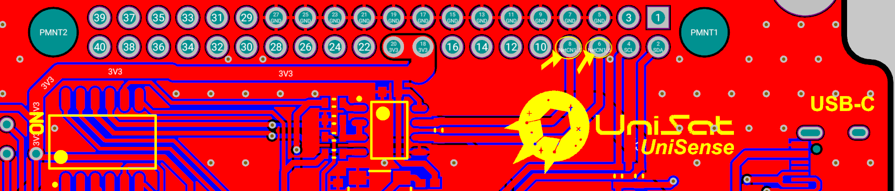

As it’s obvious by the name, Sensor board is the part which responsible for reading (or responding) sensor data.

Note: For your better understanding and experience, please consider using [Online 3D Viewer of SB](https://unepg.github.io/unisat/) ,which might quite useful and always up to date with latest UniSat PCB design.

## SB Hardware Overview

    
  
<i>Unisat Sensor Board (3D)</i>

As you can see easily from the Picture, SB includes several major parts and components, and they are :

- UniSat BUS (40 pin connector)
- 6 node switch 
- STM32L0
- Arduino Pro Mini 3V
- SI1145 
- BME680
- BNO055 
- Geiger Counter
- USB -C Connector (To program the Arduino from PC)
- 4 pin USB connector 
- 4 pin i2c Connector

Though we have 40 pin connector as we also have on OBC, they are connected just a little bit differently on the SB.

While we have powered the OBC with pin 10 and pin 12 (channel 1), we power the SB using pin 18 and pin 	20 (Channel 3) as shown in the picture blew:

    
  
<i>Channel 3 on 40 pinc connector is used to power the SB </i>

Pin 2 (SDA) and Pin 4 (SCL) are used to provide i2c connection to the BUS. (which usually then connected and used by the RPi on OBC) as shown below:

    
  
<i>I2C lines on the SB</i>

Last important pair of pins that connected to the SB are the RS485 pins used for inter-subsystem connection:

    
  
<i>RS485 lines on the SB</i>

## MCUs on the SB

### STM32

We have two different MCU on the UniSat SB, they are STM32 and Arduino, you can use both of them either for different tasks but not at the same time.

The STM32 on the SB is a STM32L073RZT6 Ultra-low-power 32-bit MCU ARM®-based Cortex®-M0+ from ST microcontrollers .

