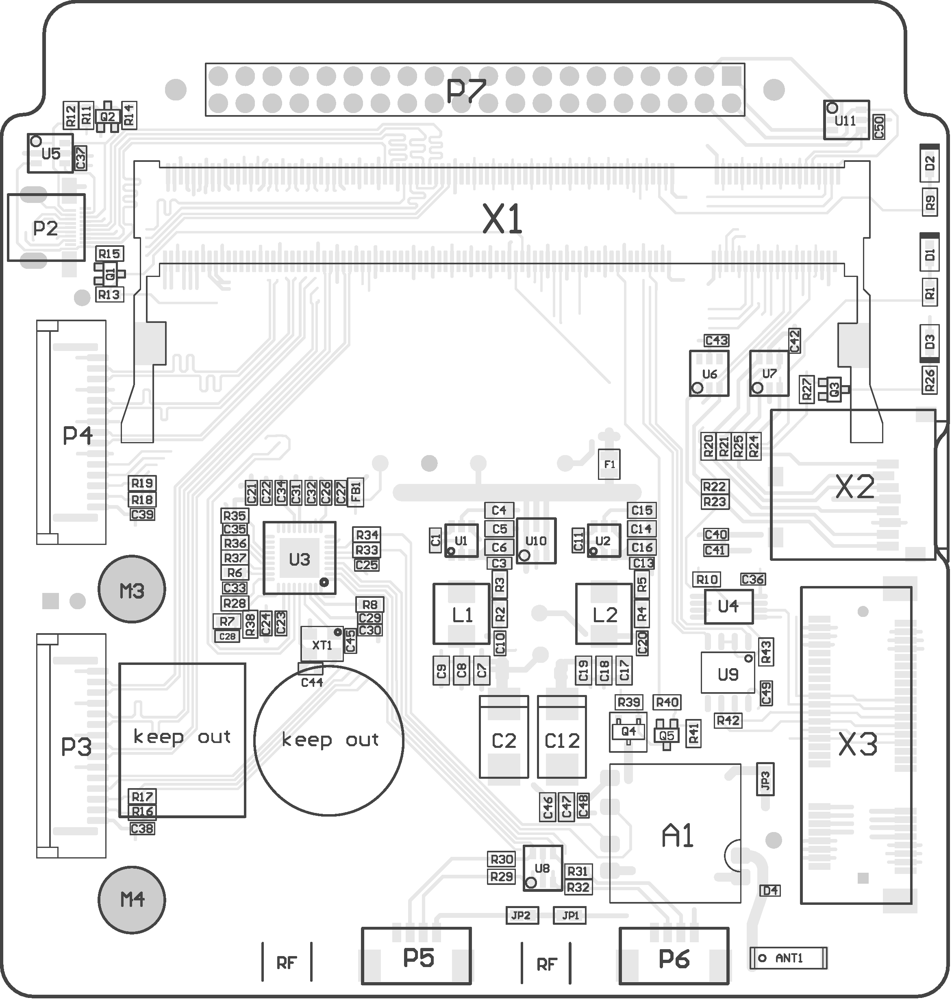
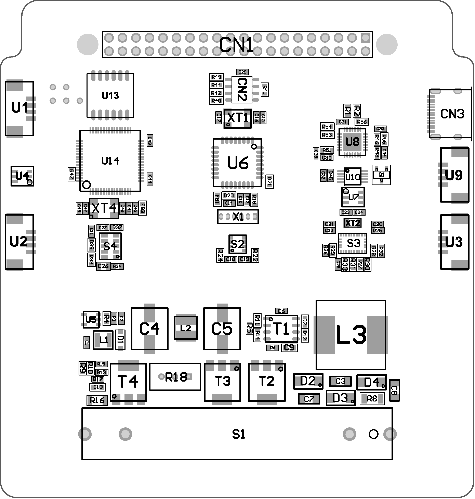
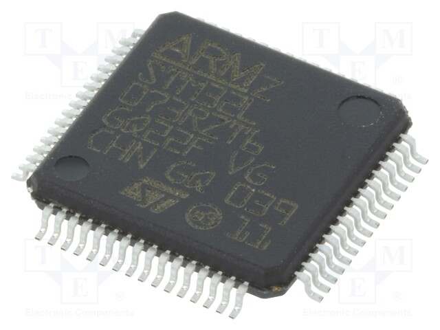

## Набор UniSat 

UniSat - это недорогой кубсат стандарта ESA 1U, который соответствует отраслевым стандартам для образовательных спутников, работает от батарей (солнечная панель может быть подключена и программно настроена), передает и получает данные через LoRa, имеет 3D-печатную рамку, предварительно собранную плату полезной нагрузки STEM (SB) и может быть расширен дополнительными датчиками и модулями.

    

<i>Набор UniSat</i>

Платформа UniSat представляет собой набор аппаратного/встроенного программного обеспечения+ инструментов для обучения STEM и научных и инженерных экспериментов. Подразделение Наноспутниковой образовательной программы для девочек  финансируется [Казахами ЮНИСЕФ](http://unicef.org ), организованный Научным парком Аль-Фараби, основан на наборе UniSat.

## Аппаратные компоненты набора UniSat 

    

Аппаратные компоненты  набора UniSat включает в себя  :

1. 3D Печатная спутниковая рамка 
2. Алюминиевая рама для полетов
3. A
4. B
5. Зарядное устройство для аккумулятора и Зарядный кабель
6. Модули камеры  x2 
7. Наземная станция
8. Антенная плата
9. Плата полезной нагрузки STEM  (Плата датчиков)
10. Плата EPS 
11. OBC + TRX плата  (Управление полетом и передача )
12. TOP Плата 
13. Плата батареи (Блок питания)
14. Антенные кабели x2 (GPS + GSM + LoRa)
15. Винт x3
16. M3 x YY 
17. Внешняя антенна для полетов (не помещается на картинке)
18. Руководство пользователя

    

<i>Антенна Яги</i>

## Аппаратное обеспечение OBC

    
  
<i>Макет OBC UniSat</i>

| Основной Поставщик Вычислительной Мощности                   | Память                     | Физические интерфейсы                                        | Сетевое подключение | Размеры      |
| ------------------------------------------------------------ | -------------------------- | ------------------------------------------------------------ | ------------------- | ------------ |
| Raspberry Pi CM3/CM3 Lite (4C/1,4 ГГц, 1 ГБ оперативной памяти ) | 4 GB eMMC 64 GB MicroSD/TF | - USB2.0 — 2  - RS485 — 1  - I2C — 1  - CSI — 2  - UART — 1* | WiFi 802.11 b\g\n   | `10*10*0.46` |

- Процессор: BCM2837
- Количество ядер процессора: 4
- Архитектура процессора: ARM
- Ядро процессора: ARMv8
- Оперативная память (ОЗУ): 1Гб
- Память: 64 Гб microSD
- Энергонезависимая память: 64 Кбит
- Беспроводной интерфейс: Wi-Fi
- Всего интерфейсов USB:  2
- Общее количество интерфейсов камеры: 2 CSI
- Физический интерфейс для подключения устройств: mini-PCI
- Электрические интерфейсы для связи с аппаратными устройствами: I2C и RS485

## Аппаратное обеспечение SB

SB, он же плата полезной нагрузки STEM

    
  
<i>Макет SB UniSat</i>

Основными частями на SB являются :

| Имя              | Тип                              | Описание                                                     |
| ---------------- | -------------------------------- | ------------------------------------------------------------ |
| STM32L073RZT6    | Микроконтроллер                  | Сверхнизкий 32-разрядный микроконтроллер на базе ARM® Cortex®-M0+ |
| Atmega 328P      | Микроконтроллер                  | Высокопроизводительный 8-разрядный микроконтроллер с низким энергопотреблением на основе архитектуры AVR RISC. |
| BME680           | Интегрированное Слияние Датчиков | Встроенные высоколинейные и высокоточные датчики газа, давления, влажности и температуры. |
| BNO055           | Интегрированное Слияние Датчиков | Система в пакете (SIP) решение, которое объединяет трехосный 14-разрядный акселерометр, точный трехосный 16-разрядный гироскоп с замкнутым контуром, трехосный геомагнитный датчик и 32-разрядный микроконтроллер |
| SI1145           | Датчик                           | Цифровой датчик УФ-индекса/ИК/Видимого света                 |
| Счетчик Гейгера* | Датчик                           | Блок обнаружения и измерения ионизирующего излучения.        |
| SDS011*          | Унифицированный Датчик           | Датчик качества воздуха PM2.5/PM10 с 8-битным процессором на чипе. |

### STM32L073RZT6

    
  
<i>STM32L073RZT6 на SB (Взято : Электронные компоненты)</i>

Микросхема микроконтроллера серии ARM® Cortex®-M0+ 32-разрядная 32 МГц 192 КБ (192 К x8) флэш-память  64-LQFP (10x10)

#### Особенности в  SB

- Платформа со сверхнизким энергопотреблением
- Ядро: Arm **32-бит  Cortex-M0**+ с MPU
  - От 32 кГц до 32 МГц максимум.
  - 0.95 DMIPS/MГц
- Память
  - Флэш-память объемом до 192 Кбайт с ECC (2 банка с возможностью чтения во время записи)
  - Оперативная память объемом 20 Кбайт
  - 6 Кбайт данных EEPROM с ECC
  - 20-байтовый резервный регистр
  - Защита сектора от R/W-операций
- До 84 быстрых входов/выходов (78  входов/выходов выносливаемых 5 В)
- Источник тактовых импульсов 
  - Высокоскоростной внутренний 16 МГц с заводской отделкой RC (+/- 1%)
- Запрограммированный загрузчик
  - USB, **поддерживает USART ** ***(USART только на SB)***
- Поддержка развития
  - Поддерживается  **отладка последовательного провода** 

- До 24 емкостных сенсорных каналов, поддерживающих сенсорные клавиши, линейные и поворотные сенсорные датчики
- 7-канальный  **контроллер DMA **, поддерживающий ADC, SPI, **I2C**, **USART**, DAC, Tаймеры  ***(I2C и USART на SB)***
- 11x периферийные интерфейсы связи
  - **4x USART** (2 с ISO 7816, IrDA), 1x UART (низкая мощность )
  - **3x I2C** (2 с SMBus/PMBus)

### BME680

| Особенность                        | Описание                                                     |
| ---------------------------------- | ------------------------------------------------------------ |
| Рабочий диапазон (полная точность) | Давление: 300...1100 ГПа Влажность 0...100% Температура: -40...85°C |
| Интерфейс                          | I²C                                                          |
| Среднее потребление тока           | 3,7 мкА при влажности 1 Гц, давлении и температуре           |

## Оборудование TRX 

## Оборудование EPS 

## Оборудование TOP 

## Оборудование AN 

## Оборудование BB 

