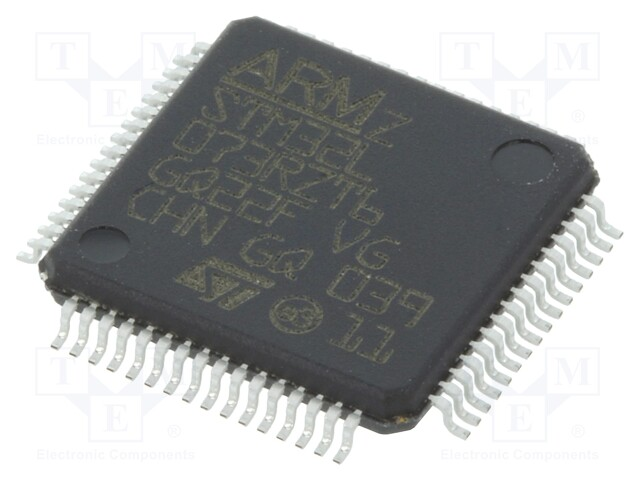

## The UniSat Set

The UniSat is a low cost, ESA standard 1U cubist that meets Industry standards for Educational Satellites, runs on batteries (solar panel can be plugged in and programmitically configured), transmits and receives data through LoRa, has a 3D printed frame, pre-build STEM Payload Board (SB), and can be extended by additional sensors and modules. 

    

<i>The UniSat Set</i>

UniSat Platform is a set of hardware/firmaware + tools for STEM education and scientific and engineering experiments. UniSat Nano-satellite Educational Programme for Girls (aka UNEPG) is founded by [UNICEF Kazakhs](https://unicef.org) organized by Al-Farabi Science Park, is based upon the UniSat Set.

## Hardware Conponents of UniSat Set

    

The Hardware Components of UniSat Set includes :

1. 3D Printed Satellite Frame
2. Aluminum Frame for Flight Missions
3. A
4. B
5. Battery Charger and Charging Cable
6. Camera Module x2 
7. Ground Station
8. Antenna Board
9. STEM Payload Board (Sensor Board)
10. EPS Board
11. OBC + TRX Board (Mission Control and Transmission )
12. TOP Board
13. Battery Board (Power Packet)
14. Antenna Cables x2 (GPS + GSM + LoRa)
15. Screw x3 
16. M3 x YY 
17. External Antenna for Flight Missions (not fit in the picture)
18. User Manual

    

<i>The Yagi Antenna</i>

## OBC Hardware

    
  
<i>The UniSat OBC Layout</i>

| Main Computing Power Provider                   | Memory                     | Physical Interfaces                                          | Network Connection | Dimensions   |
| ----------------------------------------------- | -------------------------- | ------------------------------------------------------------ | ------------------ | ------------ |
| Raspberry Pi CM3/CM3 Lite (4C/1.4 Ghz, 1GB RAM) | 4 GB eMMC 64 GB MicroSD/TF | - USB2.0 — 2  - RS485 — 1  - I2C — 1  - CSI — 2  - UART — 1* | WiFi 802.11 b\g\n  | `10*10*0.46` |

- Processor: BCM2837
- Number of CPU Cores: 4
- CPU Architecture: ARM
- CPU Core: ARMv8
- Random Access Memory (RAM): 1GB
- Memory: 64 GB microSD
- Non-volatile Memory: 64Kbit
- Wireless Interface: WiFi
- Total USB interfaces: 2
- Total Camera Interfaces : 2 CSI
- Physical Interface for Connecting Devices: mini-PCI
- Electrical Interfaces for Communication with hardware devices: I2C and RS485

## SB Hardware

SB aka STEM Payload Board

    
  
<i>The UniSat SB Layout</i>

Main parts on the SB are :

| Name            | Type                     | Desc                                                         |
| --------------- | ------------------------ | ------------------------------------------------------------ |
| STM32L073RZT6   | Microcontroller          | Ultra-low-power 32-bit MCU ARM®-based Cortex®-M0+            |
| Atmega 328P     | Microcontroller          | High performance, low power 8-bit microcontroller based on AVR RISC architecture. |
| BME680          | Integrated Sensor Fusion | Integrated high-linearity and high-accuracy gas, pressure, humidity and temperature sensors. |
| BNO055          | Integrated Sensor Fusion | System in Package (SiP) solution that integrates a triaxial 14-bit accelerometer, an accurate close-loop triaxial 16-bit gyroscope, a triaxial geomagnetic sensor and a 32-bit microcontroller |
| SI1145          | Sensor                   | Digital UV Index / IR / Visible Light Sensor                 |
| Geiger counter* | Sensor                   | Detecting and measuring  unit for ionizing radiation.        |
| SDS011*         | Unified Sensor           | PM2.5/PM10 Air Quality Sensor with 8bit processor on chip.   |

### STM32L073RZT6

    
  
<i>The STM32L073RZT6 on SB (Credit: Electronic Components)</i>

ARM® Cortex®-M0+ series Microcontroller IC 32-Bit 32MHz 192KB (192K x 8) FLASH 64-LQFP (10x10)

#### Features  on SB

- Ultra-low-power platform
- Core: Arm **32-bit Cortex-M0**+ with MPU
  - From 32 kHz up to 32 MHz max.
  - 0.95 DMIPS/MHz
- Memories
  - Up to 192-Kbyte Flash memory with ECC (2 banks with read-while-write capability)
  - 20-Kbyte RAM
  - 6 Kbytes of data EEPROM with ECC
  - 20-byte backup register
  - Sector protection against R/W operation
- Up to 84 fast I/Os (78 I/Os 5V tolerant)
- Clock sources
  - High speed internal 16 MHz factory-trimmed RC (+/- 1%)
- Pre-programmed bootloader
  - USB, **USART supported** ***(USART only on SB)***
- Development support
  - **Serial wire debug** supported

- Up to 24 capacitive sensing channels supporting touchkey, linear and rotary touch sensors
- 7-channel **DMA controller**, supporting ADC, SPI, **I2C**, **USART**, DAC, Timers ***(I2C and USART on SB)***
- 11x peripheral communication interfaces
  - **4x USART** (2 with ISO 7816, IrDA), 1x UART (low power)
  - **3x I2C** (2 with SMBus/PMBus)

### BME680

| Feature                         | Desc                                                         |
| ------------------------------- | ------------------------------------------------------------ |
| Operation range (full accuracy) | Pressure: 300...1100 hPa Humidity 0…100% Temperature: -40…85°C |
| Interface                       | I²C                                                          |
| Average current consumption     | 3.7 µA at 1 Hz humidity, pressure and temperature            |

## TRX Hardware

## EPS Hardware 

## TOP Hardware

## AN Hardware

## BB Hardware

