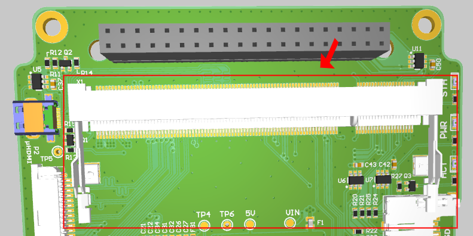

## Вступление

Примечание: Для вашего лучшего понимания и опыта, пожалуйста, рассмотрите возможность использования [Онлайн-3D-просмотра OBC](https://unepg.github.io/unisat /), что может быть весьма полезно и всегда в курсе последних разработок печатных плат UniSat.

<p align="center">
    
  <p align="center"><i>UniSat</i></p>
</p>
Бортовой компьютер (далее именуемый OBC) является неотъемлемой частью космического аппарата, а также основным вычислительным блоком UniSat. Основная нагрузка ложится на OBC, и все узлы и подсистемы должны управляться, выполняться алгоритмами, встроенными в бортовой компьютер. В целях использования в образовании бортовой компьютер также должен выполнять функции интерактивного справочного документа или книги, среды разработки и центра связи для других подсистем.

В дополнение к этому, бортовой компьютер (OBC) является основным мозгом спутника, отвечающим за все основные функции, такие как сбор системных данных, ведение журнала, обработка ошибок, мониторинг данных и т.д.

Здесь,  у нас есть две камеры на OBC, одна из которых является общей камерой RPi, которая отвечает за захват красивых космических изображений, в то время как другая отвечает за видеозаписи.

Задача захвата (как изображения, так и видеозаписи) - это задача, разработанная программным обеспечением, которая выполняется почти в течение всего срока службы спутника в циклическом периоде.

<p align="center">
    
  <p align="center"><i>Жизненный цикл в Unisat</i></p>
</p>

В этом документе мы представим все основные аппаратные компоненты OBC один за другим.

## Шина UniSat  (40 контакта)

Первое, что вы заметите в каждом аппаратном обеспечении подсистемы UniSat, - это 40-контактную шину. Именно так подсистемы UniSat взаимодействуют друг с другом и получают от них энергию.

<p align="center">
    
  <p align="center"><i>40-контактная шина соединяет все подсистемы</i></p>
</p>

Не все из 40 контактов подключены к OBC, мы можем ясно видеть это из [3D-представления печатной платы](https://unepg.github.io/unisat/obc.html)

<p align="center">
    
  <p align="center"><i> A/B Линии RS485</i></p>
</p>

Как вы можете видеть, вывод 6 (RS485A) и вывод 8 (RS485B) соединены параллельно, и их можно найти на каждой печатной плате, о чем мы подробно поговорим позже, в основном они используются для связи между различными подсистемами.

<p align="center">
    
  <p align="center"><i>Линии I2C </i></p>
</p>

Вы также можете найти два названия контактов, так как SDA (вывод 2) и SCL (вывод 4) подключены к OBC. Использование этих двух линий дает нам возможность напрямую взаимодействовать и управлять датчиками на плате датчиков (потому что у нас достаточно ресурсов на OBC, и нам будет намного проще программировать датчики на устройстве Linux).

<p align="center">
    
  <p align="center"><i>Power линии ОВС </i></p>
</p>


Вывод 10 и вывод 12 вместе питают OBC от EPS.

<p align="center">
    
  <p align="center"><i>Пин OBC `Busy` </i></p>
</p>

У нас также есть пин Busy (пин 1), подключенный к OBC, который в основном используется для связи, о которой мы подробно поговорим позже.

Вот полная таблица распиновки 40-контактной ШИНЫ:

| RFU  | RFU  | RFU  | 7V4  | 5V   | 3V3  | GND  | GND  | GND  | GND  | GND  | GND  | GND  | GND  | **GND**  | **GND**  | GND         | GND          | INT         | BUSY        |
| ---- | ---- | ---- | ---- | ---- | ---- | ---- | ---- | ---- | ---- | ---- | ---- | ---- | ---- | -------- | -------- | ----------- | ------------ | ----------- | ----------- |
| 39   | 37   | 35   | 33   | 31   | 29   | 27   | 25   | 23   | 21   | 19   | 17   | 15   | 13   | 11       | 9        | 7           | 5            | **3**       | **1**       |
| 40   | 38   | 36   | 34   | 32   | 30   | 28   | 26   | 24   | 22   | 20   | 18   | 16   | 14   | 12       | 10       | 8           | 6            | 4           | 2           |
| RFU  | RFU  | RFU  | 7V4  | 5V   | 3V3  | CH 5 | CH 5 | CH 4 | CH 4 | CH 3 | CH 3 | CH 2 | CH 2 | **CH 1** | **CH 1** | **RS485 B** | **RS485  A** | **I2C SCL** | **I2C SDA** |

А вот электрическая схема Шины :

<p align="center">
    
  <p align="center"><i>Схема Шины UniSat </i></p>
</p>


##  RPi CM3L и  SODIMM Соединитель

Большой разъем, который вы можете легко увидеть на печатной плате OBC, - это разъем `SODIMM`, предназначенный для подключения вычислительного модуля Raspberry Pi 3+ Lite (или RPi CM3L)

<p align="center">
    
  <p align="center"><i>SODIMM Соединитель в OBC</i></p>
</p>

Вычислительный модуль Raspberry Pi 3+ (CM3+) представляет собой линейку DDR2-SODIMM - механически совместимых систем на модулях (SOM), содержащих процессор, память, флэш-память eMMC (в вариантах, отличных от Lite) и поддерживающие схемы питания.[1] Эти модули позволяют разработчику использовать аппаратный и программный стек Raspberry Pi в своих собственных пользовательских системах и форм-факторах. Вот почему и как мы используем его в качестве нашего основного вычислительного ресурса на UniSat. 

CM3+ содержит процессор BCM2837B0 (как используется в Raspberry Pi 3B+), 1 Гбайт LPDDR2
Оперативная память и флэш-память eMMC. CM3+ в настоящее время доступен в 4 вариантах: CM3+/8 ГБ, CM3+/16 ГБ,CM3+/32 ГБ и CM3+ Lite, которые имеют 8, 16 и 32 гигабайта флэш-памяти eMMC или не имеют флэш-памяти eMMC . 

Для такой системы, как UniSat, 32 ГБ места может показаться маловато, и нам нужна дополнительная возможность расширения за счет использования облегченной версии и замены SD-карты для флэш-памяти eMMC.

Таким образом, вы можете свободно использовать и выбирать любую емкость для диска RPi.


<p align="center">
    
  <p align="center"><i>CM3+L в OBC</i></p>
</p>


### Особенности RPi CM3/CM3+  

#### Оборудование

-  2x I2C (один используется для управления двумя камерами на OBC, а другой подключен к линиям I2C на шине для получения данных с сенсорной платы)
- 1x 4-полосный интерфейс камеры CSI (до 1 Гбит/с на полосу) (Используется для подключения камеры 0 на OBC)
- 1x 2-полосный интерфейс камеры CSI (до 1 Гбит/с на полосу) (Используется для подключения камеры 1 на ABC)
- 2x UART (Так как только один из UART на RPi идеально подходит для использования на CM3L, и он сначала преобразуется, а затем подключается к линиям RS A/B на шине UniSat)
- 2x SD/SDIO (подключен к интерфейсу SD-карты на OBC)
- 1x HDMI 1.3a (подключен к интерфейсу Micro HDMI на OBC)
- 1x USB 2 ХОСТ/OTG (подключен к USB-концентратору, затем он подключен к 4-контактным USB-разъемам и модулю Wi-Fi на ОBC)

#### Программное обеспечение

- Набор инструкций ARMv8
- Развитый и стабильный программный стек Linux
  - Новейшее обеспечение ядра Linux 
  - Many drivers upstreamed
  - Стабильная и хорошо поддерживаемая пользовательское окружение
  - Полная доступность функций графического процессора с использованием стандартных APIs
  - Стабильная ОS на базе Debian для спутника

#### Блок диаграмма CM3 


CM3 имеет 200 контактов, которые доступны через модули SODIMM DDR2 (1,8 В) (но не все из них подключены к печатной плате) и подключены, как показано на следующей схеме :


#### Важные назначения выводов CM3 на OBC UniSat

| Пин  | Функция | Прекращение | Описание            |
| ---- | ------- | ----------- | ------------------- |
| 0    | input   | pull_up     | *CAMERA 1 I2C0 SDA* |
| 1    | input   | pull_up     | *CAMERA 1 I2C0 SCL* |
| 2    | input   | pull_up     | *SMPS_SCL*          |
| 3    | input   | pull_up     | *SMPS_SDA*          |
| 14   | uart0   | no_pulling  | *TX uart0*          |
| 15   | uart0   | pull_up     | *RX uart0*          |
| 28   | input   | pull_up     | *CAMERA 0 I2C0 SDA* |
| 29   | input   | pull_up     | *CAMERA 0 I2C0 SCL* |
| 36   | output  | pull_up     | *WIFI DIS*          |
| 40   | output  | pull_up     | *HAB RESET*         |
| 46   | input   | no_pulling  | *Hot-plug*          |
| 47   | output  | no_pulling  | *EMMC_ENABLE_N*     |
| 48   | sdcard  | pull_up     | *SD CLK*            |
| 49   | sdcard  | pull_up     | *SD CMD*            |
| 50   | sdcard  | pull_up     | *SD D0*             |
| 51   | sdcard  | pull_up     | *SD D1*             |
| 52   | sdcard  | pull_up     | *SD D2*             |
| 53   | sdcard  | pull_up     | *SD D3*             |

#### Образец файла источника дерева устройств (ИДУ) для управления CM3 на OBC UniSat

```dtd
/dts-v1/;

/ {
  videocore {

    pins_cm3 {

      pin_config {

        pin@default {
          polarity = "active_high";
          termination = "pull_down";
          startup_state = "inactive";
          function = "input";
        }; // pin

        pin@p0  { function = "input";  	termination = "pull_up";    }; // CAMERA 1 I2C0 SDA
        pin@p1  { function = "input";  	termination = "pull_up";    }; // CAMERA 1 I2C0 SCL
		
        pin@p2 { function = "input";  	termination = "pull_up";    }; // SMPS_SCL
        pin@p3 { function = "input";  	termination = "pull_up";    }; // SMPS_SDA

        pin@p14 { function = "uart0";  	termination = "no_pulling"; drive_strength_mA = < 8 >; }; // TX uart0
        pin@p15 { function = "uart0";  	termination = "pull_up";    drive_strength_mA = < 8 >; }; // RX uart0
		
        pin@p28 { function = "input";  	termination = "pull_up";    }; // CAMERA 0 I2C0 SDA
        pin@p29 { function = "input";  	termination = "pull_up";    }; // CAMERA 0 I2C0 SCL
		
	pin@p36 { function = "output";	termination = "pull_up"; startup_state = "inactive";	}; 				// WIFI DIS
	pin@p40	{ function = "output"; 	termination = "pull_up"; polarity = "active_low"; startup_state = "inactive"; };	// HAB RESET

        pin@p42  { function = "output"; termination = "no_pulling"; }; 	// CAMERA 0 LED
        pin@p43  { function = "output"; termination = "no_pulling"; }; 	// CAMERA 0 SHUTDOWN
        pin@p44 { function = "output"; 	termination = "no_pulling"; };	// CAMERA 1 LED
        pin@p45 { function = "output"; 	termination = "no_pulling"; };	// CAMERA 1 SHUTDOWN
		
        pin@p46 { function = "input";  termination = "no_pulling"; polarity = "active_low"; }; // Hotplug
        pin@p47 { function = "output"; termination = "no_pulling"; polarity = "active_low"; }; // EMMC_ENABLE_N
	pin@p48 { function = "sdcard"; 	termination = "pull_up";    drive_strength_mA = < 8 >; }; // SD CLK
        pin@p49 { function = "sdcard"; 	termination = "pull_up";    drive_strength_mA = < 8 >; }; // SD CMD
        pin@p50 { function = "sdcard"; 	termination = "pull_up";    drive_strength_mA = < 8 >; }; // SD D0
        pin@p51 { function = "sdcard"; 	termination = "pull_up";    drive_strength_mA = < 8 >; }; // SD D1
        pin@p52 { function = "sdcard"; 	termination = "pull_up";    drive_strength_mA = < 8 >; }; // SD D2
        pin@p53 { function = "sdcard"; 	termination = "pull_up";    drive_strength_mA = < 8 >; }; // SD D3

      }; // pin_config

      pin_defines {
        pin_define@HDMI_CONTROL_ATTACHED 	{ type = "external"; number = <0>; };
        pin_define@EMMC_ENABLE 				{ type = "external"; number = <1>; };
        pin_define@POWER_LOW 				{ type = "absent"; };
        pin_define@LEDS_DISK_ACTIVITY 		{ type = "absent"; };
        pin_define@LAN_RUN 					{ type = "absent"; };
        pin_define@SMPS_SDA 				{ type = "internal"; number = <2>; };
        pin_define@SMPS_SCL 				{ type = "internal"; number = <3>; };
        pin_define@ETH_CLK 					{ type = "absent"; };
        pin_define@WL_LPO_CLK 				{ type = "absent"; };
        pin_define@USB_LIMIT_1A2 			{ type = "absent"; };
        pin_define@SIO_1V8_SEL 				{ type = "absent"; };
        pin_define@PWML 					{ type = "absent"; };
        pin_define@PWMR 					{ type = "absent"; };
        pin_define@SAFE_MODE 				{ type = "absent"; };
        pin_define@SD_CARD_DETECT 			{ type = "absent"; };
        pin_define@ID_SDA 					{ type = "absent"; };
        pin_define@ID_SCL 					{ type = "absent"; };

        pin_define@NUM_CAMERAS 				{ type = "internal"; number = <2>; };
        pin_define@CAMERA_0_LED 			{ type = "internal"; number = <42>; };
        pin_define@CAMERA_0_SHUTDOWN 		{ type = "internal"; number = <43>; };
        pin_define@CAMERA_0_UNICAM_PORT 	{ type = "internal"; number = <0>; };
        pin_define@CAMERA_0_I2C_PORT 		{ type = "internal"; number = <0>; };
        pin_define@CAMERA_0_SDA_PIN 		{ type = "internal"; number = <28>; };
        pin_define@CAMERA_0_SCL_PIN 		{ type = "internal"; number = <29>; };
        pin_define@CAMERA_1_LED 			{ type = "internal"; number = <44>; };
        pin_define@CAMERA_1_SHUTDOWN 		{ type = "internal"; number = <45>; };
        pin_define@CAMERA_1_UNICAM_PORT 	{ type = "internal"; number = <1>; };
        pin_define@CAMERA_1_I2C_PORT 		{ type = "internal"; number = <0>; };
        pin_define@CAMERA_1_SDA_PIN 		{ type = "internal"; number = <0>; };
        pin_define@CAMERA_1_SCL_PIN 		{ type = "internal"; number = <1>; };
      }; // pin_defines

    }; // pins_cm3

  };

};

```

Примечание: Пожалуйста, обратите внимание  к разделу программного обеспечения документации для получения более подробной информации о OBC RPi.

## Камеры на  OBC

OBC поставляется в общей сложности с двумя различными модулями камеры, и они отличаются как по форме, так и по функциям

#### Камера 0

Камера 0 на UniSat, подключенная к OBC, представляет собой 5-мегапиксельный 175-градусный широкоугольный объектив "Рыбий глаз" с модулем камеры Raspberry Pi OV5647. Который обычно располагается в нижней части космического корабля, чтобы он мог делать красивые снимки земли из космоса.

<p align="center">
    
  <p align="center"><i>Камера "Рыбий глаз" на OBC</i></p>
</p>


Основные техничсекие характеристики камеры 0:

- **Тип датчика : OV5647** 
- **Разрешение:2592 x 1944**
- **Объектив: f=3.6 mm, f/2.9**
- **Поле зрения: 175 градусов**
- **Расстояние до объекта: от 5cм до бесконечности**
- **Частота кадров видео: 1080p со скоростью 30 кадров в секунду с кодеком H.264 (AVC)** (**Видео до 90 кадров в секунду на VGA**)
- **500 миллион пикселя**

#### Камера 1

<p align="center">
    
  <p align="center"><i> Камера  1 в OBC</i></p>
</p>


Камера 1 на OBC является стандартным модулем камеры raspberry pi и поставляется со спецификациями, как показано ниже:

- **Датчик Sony IMX219 **
- **8-мегапиксельный**
- **Поддерживает видеорежимы 1080p30, 720p60 и VGA90**

## Другие основные аппаратные компоненты OBC

OBC поставляется с другими аппаратными компонентами, такими как два 4-контактных USB-концентратора для подключения других подчиненных USB-устройств, Micro HDMI для подключения к внешним дисплеям, слот для карт microSD для использования с TF (карта microSD). Вы можете обратиться к схемам OBC и печатной плате для получения подробной информации о них.

