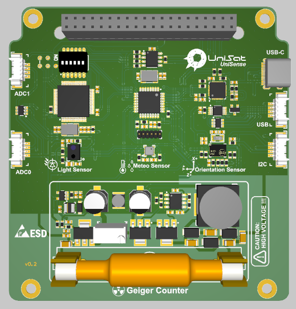
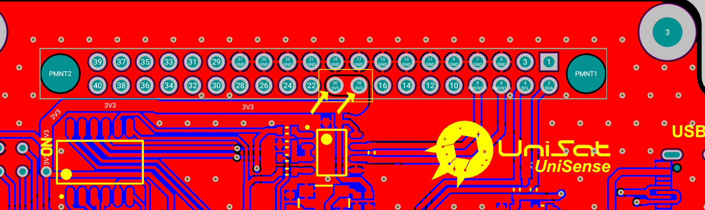
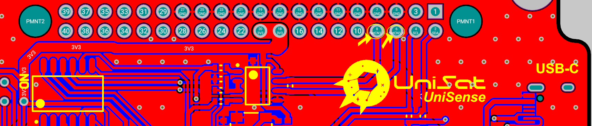
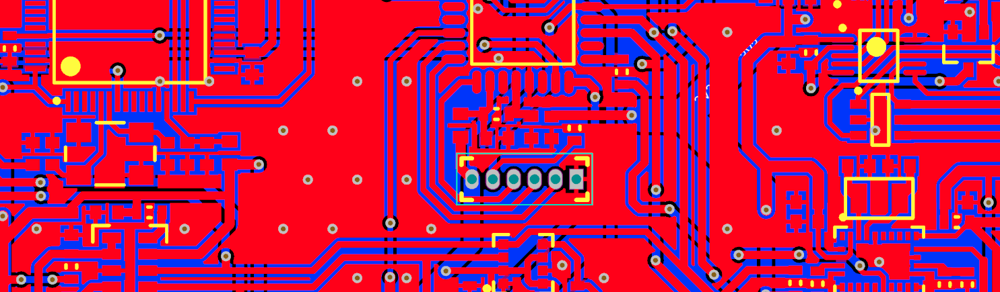
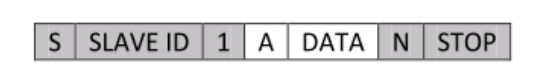

As it’s obvious by the name, Sensor board is the part which responsible for reading (or responding) sensor data.

Note: For your better understanding and experience, please consider using [Online 3D Viewer of SB](https://unepg.github.io/unisat/) ,which might quite useful and always up to date with latest UniSat PCB design.

## SB Hardware Overview

<p align="center">
    
  <p align="center"><i>Unisat Sensor Board (3D)</i></p>
</p>

As you can see easily from the Picture, SB includes several major parts and components, and they are :

- UniSat BUS (40 pin connector)
- 6 node switch 
- STM32L0
- Arduino Pro Mini 3V
- SI1145 
- BME680
- BNO055 
- Geiger Counter
- USB -C Connector (To program the Arduino from PC)
- 4 pin USB connector 
- 4 pin i2c Connector

Though we have 40 pin connector as we also have on OBC, they are connected just a little bit differently on the SB.

While we have powered the OBC with pin 10 and pin 12 (channel 1), we power the SB using pin 18 and pin 	20 (Channel 3) as shown in the picture blew:

<p align="center">
    
  <p align="center"><i>Channel 3 on 40 pinc connector is used to power the SB </i></p>
</p>

Pin 2 (SDA) and Pin 4 (SCL) are used to provide i2c connection to the BUS. (which usually then connected and used by the RPi on OBC) as shown below:

<p align="center">
    
  <p align="center"><i>I2C lines on the SB</i></p>
</p>

Last important pair of pins that connected to the SB are the RS485 pins used for inter-subsystem connection:

<p align="center">
    
  <p align="center"><i>RS485 lines on the SB</i></p>
</p>
## MCUs on the SB

### STM32

We have two different MCU on the UniSat SB, they are STM32 and Arduino, you can use both of them either for different tasks but not at the same time.

The STM32 on the SB is a STM32L073RZT6 Ultra-low-power 32-bit MCU ARM®-based Cortex®-M0+ from ST microcontrollers .

Features of the STM32 on SB:

- Ultra-low-power platform

- Core: Arm® 32-bit Cortex®-M0+ with MPU

- 192-Kbyte Flash memory with ECC

- 20-Kbyte RAM

- 6 Kbytes of data EEPROM with ECC

- 20-byte backup register

- Sector protection against R/W operation

- USART supported (connected to the RS485 lines)

- Serial wire debug supported

  <p align="center">
      
    <p align="center"><i>Serial Wire Debugger Pins on the SB</i></p>
  </p>

- 7-channel DMA controller (Used for UART and can be configured to use with I2C)

-  I2C from MCU connected to the I2C sensors and the UniSat BUS.

- 11x timers: 2x 16-bit with up to 4 channels, 2x 16-bit with up to 2 channels, 1x 16-bit ultra-low-power timer, 1x SysTick, 1x RTC, 2x 16-bit basic for DAC, and 2x watchdogs (independent/window)

Note: Please refer to the software development part for developing UniSat software on the STM32.

### Arduino

Arduino on the SB is an AVR series Microcontroller IC with 8-Bit 20MHz 32KB (16K x 16) FLASH 32-TQFP (7x7).

Due to the majorly platform resource limitations on the Arduino, you may not use it for your main MCU/MPU for real-life tests and flight missions, but that is a nice pro to design in on the board, cause arduino is much more easy to use and learn rather than RPi on the OBC or the STM32 on the SB.

Features of the Arduino Chip on the SB:

- High Performance, Low Power AVR® 8-Bit Microcontroller Family
- 32 x 8 General Purpose Working Registers
- 16 KBytes of In-System Self-Programmable Flash program memory
- 1KBytes EEPROM
- 2KBytes Internal SRAM
- Programmable Serial USART (conencted to RS485 lines on BUS)
- I2C from MCU connected to the I2C sensors and the UniSat BUS.

REF: [ Data Sheet](https://ww1.microchip.com/downloads/en/DeviceDoc/ATmega48A-PA-88A-PA-168A-PA-328-P-DS-DS40002061B.pdf)

## Sensors on the SB

### SI1145 - PROXIMITY/UV/AMBIENT LIGHT SENSOR IC WITH I2C INTERFACE

The Si1145/46/47 is a low-power, reflectance-based, infrared proximity, ultraviolet (UV) index, and ambient light sensor with I2C digital interface and programmableevent interrupt output. This touchless sensor IC includes an analog-to-digital converter, integrated high-sensitivity visible and infrared photodiodes, digital signal processor, and one, two, or three integrated infrared LED drivers with fifteen selectable drive levels. The Si1145/46/47 offers excellent performance under a wide dynamic range and a variety of light sources including direct sunlight.

#### Pin Assignments

<p align="center">
    
  <p align="center"><i>Pin assignment of the  SI1145</i></p>
</p>


#### Placement on the SB

<p align="center">
    
  <p align="center"><i>SI1145 Schematics</i></p>
</p>

#### Ambient Light

The Si1145/46/47 has photodiodes capable of measuring both visible and infrared light. However, the visible photodiode is also influenced by infrared light (indicated as `ir` on the UniSat USK).

The measurement of illuminance requires the same spectral response as the human eye. If an accurate lux measurement is desired, the extra IR response of the visible-light photodiode must be compensated. Therefore, to allow the host to make corrections to the infrared light’s influence, the Si1145/46/47 reports the infrared light measurement on a separate channel. The separate visible and IR photodiodes lend themselves to a variety of algorithmic solutions. The host can then take these two measurements and run an algorithm to derive an equivalent lux level as perceived by a human eye. Having the IR correction algorithm running in the host allows for the most flexibility in adjusting for system-dependent variables. Forexample, if the glass used in the system blocks visible light more than infrared light, the IR correction needs to beadjusted.

#### Ultraviolet (UV) Index

- The UVI is a measure of the level of UV radiation.
- The values of the index range from zero upward - the higher the UVI, the greater the potential for damage to the skin and eye, and the less time it takes for harm to occur.
- The UVI is an important vehicle to alert people about the need to use sun protection.

> A marked increase in the incidence of skin cancer in fair-skinned populations worldwide is strongly associated with excessive UV radiation exposure from the sun and possibly artificial sources such as sunbeds. Current evidence indicates that personal habits in relation to sun exposure constitute the most important individual risk factor for UV radiation damage.
>
> The UV Index is an important vehicle to raise public awareness of the risks of excessive exposure to UV radiation, and to alert people about the need to adopt protective measures. As part of an international effort, the UV index was developed by WHO, the United Nations Environment Programme, and the World Meteorological Organization. Encouraging people to reduce their sun exposure can decrease harmful health effects and significantly reduce health care costs.

– From World Health Organization

<p align="center">
    
  <p align="center"><i>UV Index (credit:WHO)</i></p>
</p>

SI1145 on the SB usually returns three values: 

- vis – visable light 
- ir – infera light
- `uv` - uv index

Sample return values (as json from UDCCC) :

```json
{
  "id": 8,
  "updated": "2021-11-05T14:33:26.119497",
  "vis": 0,
  "ir": 253,
  "uv": 2
}
```

#### I2C Interface

The Si1145 I2C slave address is **0x60**. The Si1145/46/47 also responds to the global address (0x00) and the global reset command (0x06). Only 7-bit I2C addressing is supported; 10-bit I2C addressing is not supported. Conceptually, the I2C interface allows access to the Si1145/46/47 internal registers.


<p align='center'><i>I2C Bit Timing Diagram</i></p>

An I2C write access always begins with a start (or restart) condition. The first byte after the start condition is the I2C address and a read-write bit. The second byte specifies the starting address of the Si1145/46/47 internal register. Subsequent bytes are written to the Si1145/46/47 internal register sequentially until a stop condition is encountered. An I2C write access with only two bytes is typically used to set up the Si1145/46/47 internal address in preparation for an I2C read.

<p align="center">
    
  <p align="center"><i>Host Interface Single Write</i></p>
</p>

The I2C read access, like the I2C write access, begins with a start or restart condition. In an I2C read, the I2C master then continues to clock SCK to allow the Si1145/46/47 to drive the I2C with the internal register contents. The Si1145/46/47 also supports burst reads and burst writes. The burst read is useful in collecting contiguous, sequential registers. The Si1145/46/47 register map was designed to optimize for burst reads for interrupt handlers, and the burst writes are designed to facilitate rapid programming of commonly used fields.

<p align="center">
    
  <p align="center"><i>Host Interface Single Read</i></p>
</p>

Note: 

- Gray boxes are driven by the host to the Si1145
- White boxes are driven by the Si1145 to the host
- A = ACK or “acknowledge”
- N = NACK or “no acknowledge”
- S = START condition
- Sr = repeat START condition
- P = STOP condition


### BME680 - Gas sensor measuring relative humidity, barometric pressure, ambient temperature and gas (VOC).

The BME680 is the gas sensor that integrates high-linearity and high-accuracy gas, pressure, humidity and temperature sensors. 

In our case, BME680 on the SB works as a main source for temperature, pressure and humidity.

The BME680 on SB is located in the middle of the sensors, and connected to the MCUs and I2C bus via I2C interface.

<p align="center">
    
  <p align="center"><i>BME680 on the SB</i></p>
</p>

Indicated as ‘meteo sensor’ on the PCB, you will find it very small yet powerful. 

```json
{
  "id": 22,
  "updated": "2021-11-05T14:33:12.284962",
  "temperature": 30.42,
  "pressure": 935.33,
  "humidity": 8.6
}
```

### BNO055 - Smart sensor combining accelerometer, gyroscope, magnetometer and orientation

The smart sensor BNO055 is a System in Package (SiP) solution that integrates a triaxial 14-bit accelerometer, an accurate close-loop triaxial 16-bit gyroscope, a triaxial geomagnetic sensor and a 32-bit microcontroller running the BSX3.0 FusionLib software.

On UniSat it returns  detailed telemetry as listed below:

```json
{
  "id": 7,
  "updated": "2021-11-05T14:33:19.170418",
  "temperature": 30,
  "acceleration": {
    "id": 7,
    "bno_id": 7,
    "x": 1.58,
    "y": 0.5,
    "z": 9.67
  },
  "magnetic": {
    "id": 7,
    "bno_id": 7,
    "x": 47.75,
    "y": -19.375,
    "z": -60.5625
  },
  "gyro": {
    "id": 7,
    "bno_id": 7,
    "x": -0.004363323129985824,
    "y": -0.003272492347489368,
    "z": -0.003272492347489368
  },
  "euler": {
    "id": 7,
    "bno_id": 7,
    "x": 0,
    "y": 0,
    "z": 0
  },
  "quaternion": {
    "id": 7,
    "bno_id": 7,
    "w": 0.0078125,
    "x": 0,
    "y": 0,
    "z": 0
  },
  "linear_acceleration": {
    "id": 7,
    "bno_id": 7,
    "x": 0,
    "y": 0,
    "z": 0
  },
  "gravity": {
    "id": 7,
    "bno_id": 7,
    "x": 0,
    "y": 0,
    "z": 0
  }
}
```

You may use BNO 055 for many tasks and data analytics work.  

As we have already talked about using the I2C interface in the SI1145 section, we will omit it here. For further information about the sensors, you may refer to the software documentations on USK.

#### Geiger counter 

NOTE: GEIGER COUNTER WILL BE DEPRICATED.
