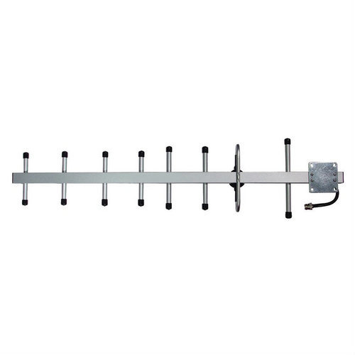
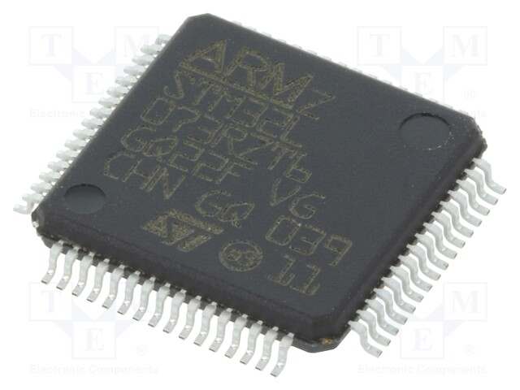

## UniSat to‘plami

UniSat – bu EKA 1U standartidagi uncha qimmat bo‘lmagan kubsat bo‘lib, u ta’lim uchun mo‘ljallangan sun’iy yo‘ldoshlarning tarmoq standartlariga muvofiq keladi, batareyalarda (ularga quyosh paneli ulanishi va shunga mos ravishda dasturlanishi mumkin) ishlaydi, LoRa orqali ma’lumotlarni uzatadi va qabul qiladi, 3D- bosib chiqarilgan ramkaga, oldindan qurilgan STEM (SB) foydali yuklama platasiga ega, u konfiguratsiyasi bo‘yicha qo‘shimcha datchiklar va modullar bilan kengaytirilishi mumkin.

    

<i>UniSat to‘plami</i>

UniSat to‘plami apparat vositalari komplektidan (firmaware) + STEM-ta’lim hamda ilmiy va muhandislik tajribalari uchun vositalardan iborat. Qizlar uchun UNIPEG UniSat Nano-satellite ta’lim sayti [UNICEF](https://unicef.org)  tashkiloti va Al-Farobiy ilmiy parki tomonidan UniSat Set to‘plami asosida tashkil qilingan.

## UniSat Set apparat komponentlari 

    

UniSat Set apparat komponentlari quyidagilarni o‘z ichiga oladi:

1. 3D-printerda bosib chiqarilgan sun’iy yo‘ldosh ramkasi
2. Parvozlar uchun alyuminiy rama
3. A
4. B
5. Zaryadlash qurilmasi va zaryadlash kabeli
6. Kamera moduli x2 
7. Yet usti stansiyasi
8. Antenna platasi
9. STEM foydali yuklama platasi (datchiklarga ega plata)
10. EPS platasi
11. OBC + TRX Plata (Parvozlarni boshqarish va ma’lumotlarni uzatish)
12. TOP plata
13. Ta’minot manbai (batareya) 
14. Antenna kabellari x2 (GPS + GSM + LoRa)
15. Vintlar 3 dona
16. M3 x YY boltlar
17. Parvozlar uchun tashqi antenna (keyingi suratda)
18. Foydalanuvchi uchun qo‘llanma

    

<i>Yagi Antenna</i>

## **Sun’iy yo‘ldoshning bort kompyuteri uskunalari to‘plami**  (OBC Hardware)

    
  
<i>UniSat Bort kompyuterining sxemasi</i>

| Asosiy kompyuter Elektr energiyasi manbai       | Xotira                     | Kiritish/chiqarish portlari                                  | Tarmoqqa ulanish  | O‘lchamlari  |
| ----------------------------------------------- | -------------------------- | ------------------------------------------------------------ | ----------------- | ------------ |
| Raspberry Pi CM3/CM3 Lite (4C/1.4 Ghz, 1GB RAM) | 4 GB eMMC 64 GB MicroSD/TF | - USB2.0 — 2  - RS485 — 1  - I2C — 1  - CSI — 2  - UART — 1* | WiFi 802.11 b\g\n | `10*10*0.46` |

- Protsessor: BCM2837
- Protsessor yadrolari soni: 4
- Protsessor arxitekturasi: ARM
- Protsessor yadrosi: ARMv8
- Xotira (RAM): 1GB
- Xotira: 64 GB microSD
- Doimiy xotira: 64Kbit
- Simsiz interfeys: WiFi
- Jami USB interfeyslari: 2
- Kamera interfeyslarining umumiy soni: 2 CSI
- Qurilmalarni ulash uchun jismoniy interfeys: mini-PCI
- Uskuna qurilmalari bilan aloqa qilish uchun elektr interfeyslari: I2C and RS485

## Apparat ta’minoti (SB)

Sun’iy yo‘ldosh foydali yuklamasining platasi (foydali yuklamaning FYu moduli)

    
  
<i>UniSat apparat ta’minoti sxemasi</i>

Quyidagilar apparat ta’minotidagi asosiy qismlar hisoblanadi:

| Nomlanishi      | Turi                       | Tavsifi                                                      |
| --------------- | -------------------------- | ------------------------------------------------------------ |
| STM32L073RZT6   | Mikrokontroller            | Ultra past 32-bitli ARM® Cortex®-M0 + mikrokontroller        |
| Atmega 328P     | Mikrokontroller            | AVR RISC arxitekturasiga asoslangan yuqori unumdor 8-bitli past quvvatli mikrokontroller. |
| BME680          | Fusion o‘rnatma datchigi   | Yuqori liniyali va yuqori aniqlikdagi o‘rnatma gaz, bosim, namlik va harorat datchiklari. |
| BNO055          | Fusion o‘rnatma datchigi   | Uch o‘qli 14-razryadli akselerometr, aniq uch o‘qli 16-razryadli yopiq konturga ega giroskop, uch o‘qli geomagnitli datchik va 32-razryadli mikrokontrollerni birlashtiruvchi System in Package (SiP) yechimi |
| SI1145          | Datchik                    | Raqamli UB-indeksi / IK / ko‘rinadigan yorug‘lik datchigi    |
| Geiger counter* | Datchik                    | Ionlashtiruvchi nurlanishni detektrlash va o‘lchash bloki.   |
| SDS011*         | Unifikatsiyalangan datchik | 8-bitli chipdagi protsessorli PM2.5 / PM10 havo sifati sensori. |

### STM32L073RZT6

    
  
<i>The STM32L073RZT6 on SB (Credit: Electronic Components)</i>

ARM® Cortex®-M0+ seriyali mikrokontroller mikrosxemasi (chipi ) 32-bit 32MHz 192KB (192K x8) 64-LQFP (10x10) Flash-xotira

#### SB xususiyatlari

- O‘ta past energiya iste’moliga ega platforma  
- Core protsessori: Arm **32-bit Cortex-M0**+ with MPU
  - maksimal 32 kHz dan 32 MHz gacha.
  - 0.95 DMIPS/MHz
- Xotira
  - ECC bilan 192 KB gacha flesh xotira (2 ta o'qish / yozish)
  - 20-Kbyte operativ xotira 
  - ECC bilan 6 Kbayt ma'lumotli EEPROM
  - 20 baytli zahiralangan registr
  - Sektorni R/W operatsiyalaridan himoya qilish
- 84 tagacha tez kiritish/chiqarish (5 V kuchlanish barqarorligi bilan 78 ta kirish)
- Taymer protsessori
  - Yuqori tezlikda RC sozlash bilan ichki, 16 MGts (+/- 1%)
- Oldindan dasturlashtirilgan yuklagich uchun chip (flesh karta)
  - **USB- ulagich, USART qo'llab-quvvatlaydi** 
- Ishlanmani qo‘llab-quvvatlash
  - simlarni ulash tuzatish qo'llab-quvvatlanadi

- Displeydan boshqarish uchun 24 dan ortiq sig‘imli kanalni qo‘llab-quvvatlovchi sensorlar 
- ADC, SPI,  **I2C,**  **USART,** DAC ni qo‘llab-quvvatlovchi 7 kanalli **DMA** kontrolleri, taymerlar ***(SB da ishlaydigan I2C va USART)***
- Periferiya aloqasining 11 ta interfeysi
  - **4x USART** (2ta bilan ISO 7816, IrDA), 1x UART (kam quvvat)
  - **3x I2C** (2ta bilan SMBus/PMBus)

### BME680

| Feature                              | Tavsifi                                                      |
| ------------------------------------ | ------------------------------------------------------------ |
| Ishchi diapazon (to‘liq aniqlik)     | Bosim: 300 ... 1100 hPa Namlik 0 ... 100% Harorat: -40 ... 85 ° S |
| Interfeys                            | I²C                                                          |
| O'rtacha elektr energiyasi iste'moli | 1 Hz urish tezligidan 3,7 microAmperni (µA), namlik, bosim va haroratni aniqlash uchun |

## TRX Hardware

## EPS Hardware 

## TOP Hardware

## AN Hardware

## BB Hardware

