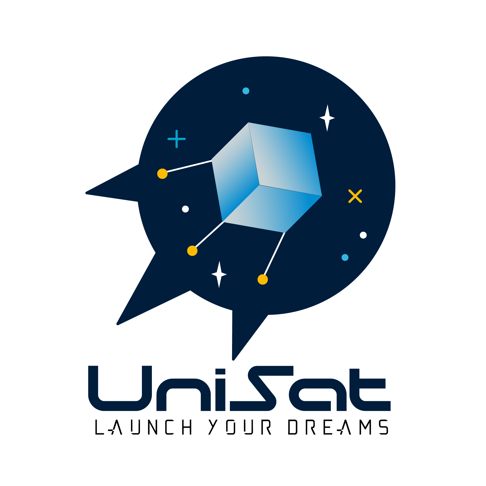
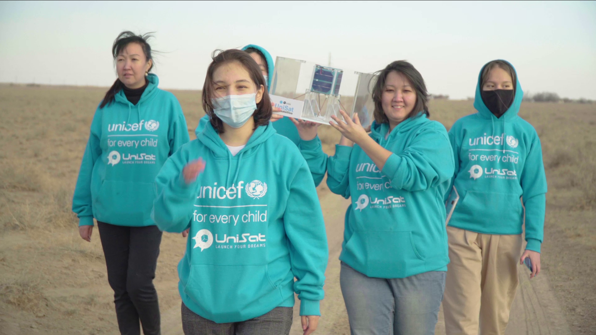

Unisat viki-saytiga xush kelibsiz! 

Bu UniSat nanosun’iy yo‘ldoshlarining butlovchilari, ularni dasturlash, yig‘ish va uchirish bo‘yicha darslarni mustaqil o‘rganish uchun mo‘ljallangan resurs. 

Viki UniSat Qozoq, Rus, O‘zbek va Qirg‘iz tillarida ham mavjud.

[Official UniSat Website](https://unisat.kz) / [Website in Uzbekistan](https://unisat.uz)

  

  <h3 align="center">UniSat</h3>

"UniSat" to‘plami va tegishli laboratoriya uskunalari, shu jumladan dasturiy ta’minot to‘plami, birgalikda talabalarni kosmik apparatni ishlab chiqish, loyihalashtirish, yig‘ish, testdan o‘tkazish va undan foydalanishning asosiy tamoyillarini o‘qitish uchun mo‘ljallangan STEM-sun’iy yo‘ldoshining murakkab platformasidan iborat.

[Birlashgan Millatlar Tashkilotining Bolalar jamg‘armasi (UNICEF)](http://unicef.org/), [O‘zbekiston Respublikasi Innovatsiyalar vazirligi](https://mininnovation.uz/en), [Tech4Impact](http://www.tech4impact.uz/) NNT, [Al-Farobiy nomidagi Qozog‘iston Milliy universiteti](https://kaznu.kz/) ko‘magida **UniSat nanosun’iy yo‘ldoshlarini** ishlab chiqish bo‘yicha ta’lim loyihasining ikkinchi bosqichini ishga tushirdi.

**UniSat** – Markaziy Osiyo qizlarining nanosun’iy yo‘ldoshlarni ishlab chiqish sohasidagi bilim va kompetentsiyalarini rivojlantirish, shuningdek ularning jamoada ishlash, omma oldida chiqish qilish, vaqtni boshqarish va kreativlik kabi ko‘nikmalarini takomillashtirish uchun hamkorlikdagi ta’lim STEM-dasturi.

O‘tgan yili 20 nafar qiz nanosun’iy yo‘ldoshlarni ishlab chiqdi va ularni ushbu dastur doirasida stratosferaga uchirdi. Uchirilgan nanosun’iy yo‘ldoshlar Yerning suratlarini olib, kelgusida tadqiqotchilar tahlil qilishi uchun radiatsiya, bosim, gravitatsiya hamda yorug‘lik va gaz tarkibi haqidagi ma’lumotlarni to‘pladi.

    

2020-yilda Qozog‘istonning turli hududlaridan 20 nafar qiz o‘zlarining nanosun’iy yo‘ldoshini uchirishdi

Bu yil Dubai Cares, UNICEF va Al-Farobiy nomidagi Qozog‘iston Milliy universiteti ko‘magida onlayn-kurs ishga tushirilmoqda, u Qozog‘iston, O‘zbekiston, Qirg‘izistonning barcha hududlarini qamrab oladi va ko‘p sonli qizlarga ta’lim beradi. 

Kurs davomida dastur ishtirokchilari kosmik apparatni ishlab chiqishning quyidagi muhim bosqichlarini o‘zlashtiradi: ishlab chiqish, dizayn, dasturlash, yig‘ish, sinovdan o‘tkazish va uchirish.

    

    Nanosun’iy yo‘ldoshlar

**Nanosun’iy yo‘ldoshlar** – bu og‘irligi 10 kg dan oshmaydigan kichik kosmik apparatlar sinfi. Bugungi kunda nanosun’iy yo‘ldoshlar jahonning yetakchi universitetlari va tijorat tashkilotlarida ishlab chiqilmoqda. UniSat sun’iy yo‘ldoshlari ta’lim maqsadlari uchun mo‘ljallangan bo‘lib, bir nechta kamera bilan jihozlangan. Kameralardan biri 4K yechimida Yerning elliptik tasvirini suratga oladi.

Qizlar aerokosmik texnika sohasining yetakchi ekspertlaridan 3D-modellashtirish, dasturiy boshqaruv bloklarini loyihalashtirish, dasturiy va apparat ta’minotini ishlab chiqish ko‘nikmalari, kommunikatsiyalar va Linux’da dasturlash asoslari bo‘yicha bilimlarga ega bo‘ladilar.

Shuningdek **UniSat** ta’lim dasturi turli faoliyat sohalaridagi muvaffaqiyatli ayollar, ekspertlarning turkum vebinarlarini ham o‘z ichiga ogan bo‘lib, ular dastur ishtirokchilari bilan o‘z muvaffaqiyat tarixlarini o‘rtoqlashadi.

Onlayn-dasturning eng yaxshi bitiruvchilari nanosun’iy yo‘ldoshni yig‘ish va uni stratoseraga uchirish bo‘yicha bir haftalik amaliy kursga Olma-ota shahriga taklif etiladi.
