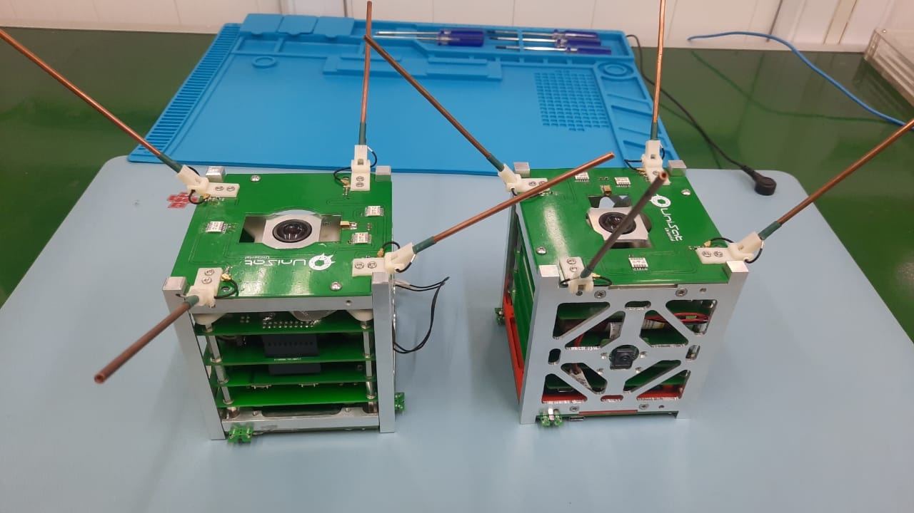
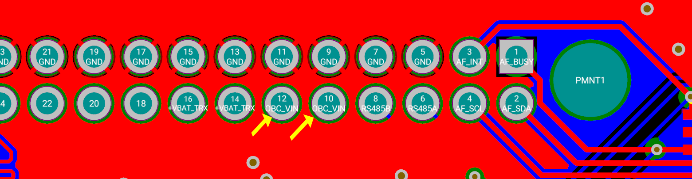
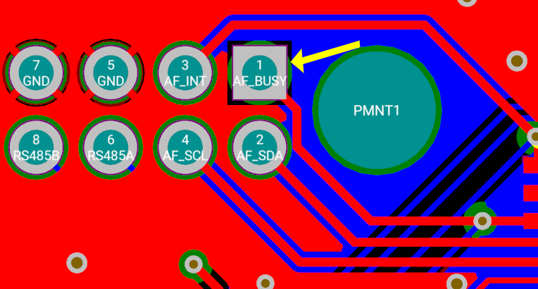
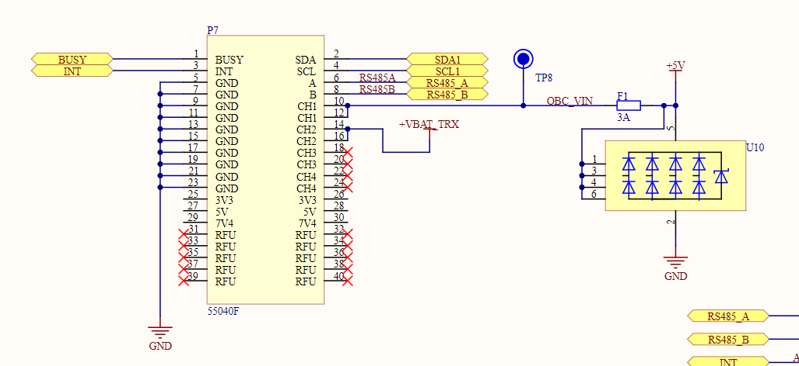
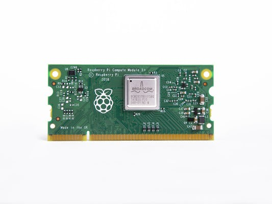
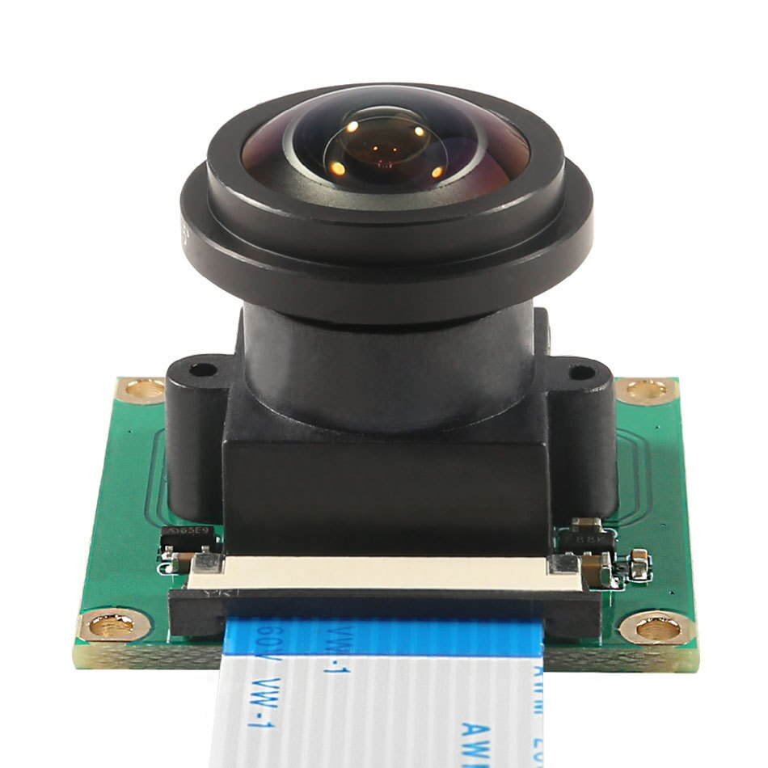

## Tanishuv

Izoh: Yaxshi tunishingiz va tajriba uchun, iltimos, foydali bo‘lishi mumkin bo‘lgan [Online 3D Viewer of OBC](https://unepg.github.io/unisat/) dasturidan foydalanish imkoniyatini ko‘rib chiqing, shunda har doim UniSat bosma platalarining oxirgi ishlanmalari haqida xabardor bo‘lasiz.

<p align="center">
    
  <p align="center"><i>UniSat</i></p>
</p>
Bort kompyuteri (quyida – OBC) kosmik apparatning ajralmas qismi hamda UniSat’ning asosiy hisoblash bloki hisoblanadi. 

Asosiy yuklama OBC ga to‘g‘ri keladi, barcha uzellar va kichik tizimlar bort kompyuteri beradigan algoritmlar tomonidan boshqariladi va bajariladi. Ta’lim jarayoni maqsadlarida brrt kompyuteri interfaol ma’lumot beruvchi hujjat yoki kitob, boshqa kichik tizimlar uchun ishlanmalar muhiti va kommunikatsiya markazi funksiyalarini ham bajaradi.

Yuqorida aytilganlarga ko‘shicha ravishda guni qayd etish mumkinki, bort kompyuteri (OBC) tizim ma’lumotlarini to‘plash, ro‘yxatdan o‘tkazish, xatoliklarga ishlov berish, ma’lumotlar monitoringi va hokazolar kabi barcha asosiy funksiyalar uchun javobgar bo‘lgan sun’iy yo‘ldoshning asosiy miyasi hisoblanadi.

Bu yerda, OBC da, bizda ikkita kamera bor, bitta umumiy Rpi kamerasi, u chiroyli kosmik tasvirlar uchun javob beradi, ikkinchisi esa videoyozuvlar uchun javob beradi.  

Nanosatdan tasvirga olish ishlari (tasvirlar ham, videoyozuvlar ham) – bu dasturiy ishlab chiqilgan jarayon bo‘lib, tasvirga olish ishlari sun’iy yo‘ldoshning deyarli butun hayotiy sikli davomida bajariladi. 

<p align="center">
    
  <p align="center"><i>Unisat’ning hayotiy sikli</i></p>
</p>


Biz ushbu hujjatda OBC ning barcha asosiy apparat komponentlarini navbatma-navbat taqdim etamiz.

## UniSat shinasi (40-kontaktli) – ma’lumotlar magistrali

Siz UniSat kichik tizimining har bir uskunasida ko‘radigan birinchi narsa bu 40-kontaktli shina (ma’lumotlar magistrali). UniSat kichik tizimlari bir-biri bilan aynan gunday muloqot qiladi va ulardan o‘z elektr ta’minotini oladi.

<p align="center">
    
  <p align="center"><i>40-kontaktli shina barcha kichik tizimlarni birlashtiradi</i></p>
</p>

40 ta kontaktdan hammasi ham OBC ga ulanmagan, biz buni [3D PCB View](https://unepg.github.io/unisat/obc.html) dasturida aniq ko‘rishimiz mumkin. Havola bo‘yicha o‘ting.

<p align="center">
    
  <p align="center"><i>RS485 A/B Lines</i></p>
</p>


Ko‘rib turganingizday, Kontakt 6 (RS485A) va Kontakt 8 (RS485B) parallel tarzda ulangan, ularni har bir bosma platada topish mumkin, bu haqda biz batafsil keyinroq so‘z yuritamiz. Ular asosan turli kichik tizimlar o‘rtasida aloqa uchun foydalaniladi.

<p align="center">
    
  <p align="center"><i>I2C Lines </i></p>
</p>


Shuningdek, siz ikkita kontaktni ham topishingiz mumkin, chunki SDA (Pin2) va SCL (Pin4) OBCga ulangan. Ushbu ikkita liniyadan foydalanish bizga bevosita muloqot qilish va sensorli platadagi datchiklarni boshqarish imkonini beradi (chunki bizda OBCda resurslar yetarli bo‘lib, Linux qurilmasida datchiklarni dasturlashimiz oson bo‘ladi).

<p align="center">
    
  <p align="center"><i>OBC Power Lines</i></p>
</p>


Kontakt 10 va kontakt 12 birgalikda OBC ni EPS dan ta’minlaydi.

<p align="center">
    
  <p align="center"><i>OBC `Busy` Pin </i></p>
</p>


Shuningdek, bizda OBCga ulangan Busy kontakt (kontakt 1) ham bor, u asosan aloqa uchun foydalaniladi, u haqda biz keyinroq batafsil so‘z yuritamiz.

Mana bu 40-PIN BUS kontaktlarining to‘liq jadvali:

| RFU  | RFU  | RFU  | 7V4  | 5V   | 3V3  | GND  | GND  | GND  | GND  | GND  | GND  | GND  | GND  | **GND**  | **GND**  | GND         | GND          | INT         | BUSY        |
| ---- | ---- | ---- | ---- | ---- | ---- | ---- | ---- | ---- | ---- | ---- | ---- | ---- | ---- | -------- | -------- | ----------- | ------------ | ----------- | ----------- |
| 39   | 37   | 35   | 33   | 31   | 29   | 27   | 25   | 23   | 21   | 19   | 17   | 15   | 13   | 11       | 9        | 7           | 5            | **3**       | **1**       |
| 40   | 38   | 36   | 34   | 32   | 30   | 28   | 26   | 24   | 22   | 20   | 18   | 16   | 14   | 12       | 10       | 8           | 6            | 4           | 2           |
| RFU  | RFU  | RFU  | 7V4  | 5V   | 3V3  | CH 5 | CH 5 | CH 4 | CH 4 | CH 3 | CH 3 | CH 2 | CH 2 | **CH 1** | **CH 1** | **RS485 B** | **RS485  A** | **I2C SCL** | **I2C SDA** |

Mana bu esa shinaning elektr sxemalari:

<p align="center">
    
  <p align="center"><i>UniSat shinalarining sxemalari </i></p>
</p>


##  RPi CM3L va SODIMM tirqishi

Siz OBC bosma platasida oson ko‘rishingiz mumkin bo‘lgan katta tirqish – bu SODIMM, u Raspberry Pi Compute Module 3 + Lite (yoki RPi CM3L) ga ulanish uchun mo‘ljallangan.

<p align="center">
    
  <p align="center"><i>SODIMM Connector on the OBC</i></p>
</p>


Raspberry Pi Compute Module 3+ (CM3+) protsessor, xotira, eMMC flesh-xotirasini (Lite variantda emas) o‘z ichiga olgan va ta’minot tizimini ushlab turuvchi modullarda DDR2-SODIMM bilan mexanik muvofiq keladigan tizimlar liniyasidan iborat. [1] Bu modullar ishlab chiquvchiga Raspberry Pi apparat va dasturiy stekidan o‘zining foydalanuvchilik tizimlarida va form-faktorlarda foydalanish imkonini beradi. Mana shuning uchun ham biz undan UniSat’da asosiy hisoblash resursi sifatida foydalanamiz. 

CM3+ qurilmasi BCM2837B0 protsessorini (Raspberry Pi 3B+ da qo‘llanadigan), 1 Gbayt LPDDR2 operativ xotirasini va eMMC flesh-xotirasini o‘z ichiga oladi. CM3+ ayni paytda 4 variantda mavjud: CM3 + / 8 GB, CM3 + / 16 GB, CM3 + / 32 GB va CM3 + Lite, ular 8, 16 va 32 gigabayt eMMC flesh-xotiraga ega yoki mos ravishda eMMC flesh-xotiraga ega emas.

UniSat kabi tazim uchun 32 GB maydon uncha katta bo‘lib ko‘rinmasligi mumkin, biz esa Lite versiyasidan foydalangan va eMMC Flash uchun SD-kartani almashtirgan holda qo‘shimcha kengayish imkoniyatiga ega bo‘lishni istayapmiz.

Shunday qilib, siz Rpi disk uchun har qanday idishni tanlashingiz va undan erkin foydalanishingiz mumkin.

<p align="center">
    
  <p align="center"><i>CM3+L в OBC</i></p>
</p>


### RPi CM3/CM3+  imkoniyatlari

#### Uskunalar

-  2x I2C (bittasi OBC da ikkita kamerani boshqarish uchun qo‘llanadi, ikkinchisi esa sensorli platadan ma’lumotlar olish uchun shinada I2C liniyalariga ulanadi)
- CSI kamerasining 1x 4-polosali interfeysi (bir polosaga 1 Gbit/s gacha) (OBC ga 0 kamerani ulash uchun foydalaniladi)
- CSI kamerasining 1x 2-polosali interfeysi (bir polosaga 1 Gbit/s gacha) (OBC ga 1 kamerani ulash uchun foydalaniladi)
- 2x UART (RPi  dagi faqat bitta UART CM3L da foydalanish uchun ideal tarzda mos keladi, u dastavval o‘zgaradi, keyin esa UniSat shinasida RS A / B liniyalariga ulanadi)
- 2x SD/SDIO (OBC dagi SD-karta interfeysiga ulangan)
- 1x HDMI 1.3a (OBC dagi Micro HDMI interfeysiga ulangan)
- 1x USB 2 HOST/OTG (USB-kontsentratorga ulangan, so‘ngra u 4 kontaktli USB-konnektorlar va OBC dagi Wi-Fi moduliga ulangan)

#### Dasturiy ta’minot

- ARMv8 ko'rsatmalar to'plami
- Etuk va barqaror Linux dasturiy ta'minot to'plami
  - Eng so'nggi Linux yadrosini qo'llab-quvvatlash
  - Ko'p haydovchilar yuqori oqim
  - Barqaror va yaxshi qo'llab-quvvatlanadigan foydalanuvchi hududi
  - Standart API yordamida GPU funksiyalarining to'liq mavjudligi
  - Sun'iy yo'ldosh uchun Debian asosidagi barqaror operatsion tizim

#### CM3 blok-sxemasi


CM3 blok-sxemasi 200 ta kontaktga ega bo‘lib, ular DDR2 (1,8 V) SODIMM modullari orqali imkonli (ammo ularning hammasi ham bosma plataga ulanmagan), ular quyidagi sxemalarda ko‘rsatilganiday ulanadi:


#### UniSat OBC da CM3 kontaktlarining muhim funksiyalari

| Pin  | Function | Termination | Description         |
| ---- | -------- | ----------- | ------------------- |
| 0    | input    | pull_up     | *CAMERA 1 I2C0 SDA* |
| 1    | input    | pull_up     | *CAMERA 1 I2C0 SCL* |
| 2    | input    | pull_up     | *SMPS_SCL*          |
| 3    | input    | pull_up     | *SMPS_SDA*          |
| 14   | uart0    | no_pulling  | *TX uart0*          |
| 15   | uart0    | pull_up     | *RX uart0*          |
| 28   | input    | pull_up     | *CAMERA 0 I2C0 SDA* |
| 29   | input    | pull_up     | *CAMERA 0 I2C0 SCL* |
| 36   | output   | pull_up     | *WIFI DIS*          |
| 40   | output   | pull_up     | *HAB RESET*         |
| 46   | input    | no_pulling  | *Hot-plug*          |
| 47   | output   | no_pulling  | *EMMC_ENABLE_N*     |
| 48   | sdcard   | pull_up     | *SD CLK*            |
| 49   | sdcard   | pull_up     | *SD CMD*            |
| 50   | sdcard   | pull_up     | *SD D0*             |
| 51   | sdcard   | pull_up     | *SD D1*             |
| 52   | sdcard   | pull_up     | *SD D2*             |
| 53   | sdcard   | pull_up     | *SD D3*             |

#### OBC UniSat’da CM3 ni boshqarish uchun tree source qurilmasi (DTS) fayliga misol

```dtd
/dts-v1/;

/ {
  videocore {

    pins_cm3 {

      pin_config {

        pin@default {
          polarity = "active_high";
          termination = "pull_down";
          startup_state = "inactive";
          function = "input";
        }; // pin

        pin@p0  { function = "input";  	termination = "pull_up";    }; // CAMERA 1 I2C0 SDA
        pin@p1  { function = "input";  	termination = "pull_up";    }; // CAMERA 1 I2C0 SCL
		
        pin@p2 { function = "input";  	termination = "pull_up";    }; // SMPS_SCL
        pin@p3 { function = "input";  	termination = "pull_up";    }; // SMPS_SDA

        pin@p14 { function = "uart0";  	termination = "no_pulling"; drive_strength_mA = < 8 >; }; // TX uart0
        pin@p15 { function = "uart0";  	termination = "pull_up";    drive_strength_mA = < 8 >; }; // RX uart0
		
        pin@p28 { function = "input";  	termination = "pull_up";    }; // CAMERA 0 I2C0 SDA
        pin@p29 { function = "input";  	termination = "pull_up";    }; // CAMERA 0 I2C0 SCL
		
	pin@p36 { function = "output";	termination = "pull_up"; startup_state = "inactive";	}; 				// WIFI DIS
	pin@p40	{ function = "output"; 	termination = "pull_up"; polarity = "active_low"; startup_state = "inactive"; };	// HAB RESET

        pin@p42  { function = "output"; termination = "no_pulling"; }; 	// CAMERA 0 LED
        pin@p43  { function = "output"; termination = "no_pulling"; }; 	// CAMERA 0 SHUTDOWN
        pin@p44 { function = "output"; 	termination = "no_pulling"; };	// CAMERA 1 LED
        pin@p45 { function = "output"; 	termination = "no_pulling"; };	// CAMERA 1 SHUTDOWN
		
        pin@p46 { function = "input";  termination = "no_pulling"; polarity = "active_low"; }; // Hotplug
        pin@p47 { function = "output"; termination = "no_pulling"; polarity = "active_low"; }; // EMMC_ENABLE_N
	pin@p48 { function = "sdcard"; 	termination = "pull_up";    drive_strength_mA = < 8 >; }; // SD CLK
        pin@p49 { function = "sdcard"; 	termination = "pull_up";    drive_strength_mA = < 8 >; }; // SD CMD
        pin@p50 { function = "sdcard"; 	termination = "pull_up";    drive_strength_mA = < 8 >; }; // SD D0
        pin@p51 { function = "sdcard"; 	termination = "pull_up";    drive_strength_mA = < 8 >; }; // SD D1
        pin@p52 { function = "sdcard"; 	termination = "pull_up";    drive_strength_mA = < 8 >; }; // SD D2
        pin@p53 { function = "sdcard"; 	termination = "pull_up";    drive_strength_mA = < 8 >; }; // SD D3

      }; // pin_config

      pin_defines {
        pin_define@HDMI_CONTROL_ATTACHED 	{ type = "external"; number = <0>; };
        pin_define@EMMC_ENABLE 				{ type = "external"; number = <1>; };
        pin_define@POWER_LOW 				{ type = "absent"; };
        pin_define@LEDS_DISK_ACTIVITY 		{ type = "absent"; };
        pin_define@LAN_RUN 					{ type = "absent"; };
        pin_define@SMPS_SDA 				{ type = "internal"; number = <2>; };
        pin_define@SMPS_SCL 				{ type = "internal"; number = <3>; };
        pin_define@ETH_CLK 					{ type = "absent"; };
        pin_define@WL_LPO_CLK 				{ type = "absent"; };
        pin_define@USB_LIMIT_1A2 			{ type = "absent"; };
        pin_define@SIO_1V8_SEL 				{ type = "absent"; };
        pin_define@PWML 					{ type = "absent"; };
        pin_define@PWMR 					{ type = "absent"; };
        pin_define@SAFE_MODE 				{ type = "absent"; };
        pin_define@SD_CARD_DETECT 			{ type = "absent"; };
        pin_define@ID_SDA 					{ type = "absent"; };
        pin_define@ID_SCL 					{ type = "absent"; };

        pin_define@NUM_CAMERAS 				{ type = "internal"; number = <2>; };
        pin_define@CAMERA_0_LED 			{ type = "internal"; number = <42>; };
        pin_define@CAMERA_0_SHUTDOWN 		{ type = "internal"; number = <43>; };
        pin_define@CAMERA_0_UNICAM_PORT 	{ type = "internal"; number = <0>; };
        pin_define@CAMERA_0_I2C_PORT 		{ type = "internal"; number = <0>; };
        pin_define@CAMERA_0_SDA_PIN 		{ type = "internal"; number = <28>; };
        pin_define@CAMERA_0_SCL_PIN 		{ type = "internal"; number = <29>; };
        pin_define@CAMERA_1_LED 			{ type = "internal"; number = <44>; };
        pin_define@CAMERA_1_SHUTDOWN 		{ type = "internal"; number = <45>; };
        pin_define@CAMERA_1_UNICAM_PORT 	{ type = "internal"; number = <1>; };
        pin_define@CAMERA_1_I2C_PORT 		{ type = "internal"; number = <0>; };
        pin_define@CAMERA_1_SDA_PIN 		{ type = "internal"; number = <0>; };
        pin_define@CAMERA_1_SCL_PIN 		{ type = "internal"; number = <1>; };
      }; // pin_defines

    }; // pins_cm3

  };

};

```

Izoh: Iltimos, OBC Rpi haqida batafsil ma’lumot olish uchun hujjatlarning dasturiy ta’minot bo‘limiga murojaat qiling. GitHub UNIPEG saytida.

## OBC’dagi kameralar

OBC kameraning ikkita turli moduli bilan yetkazib beriladi, ular shakli bo‘yicha ham, funksiyalari bo‘yicha ham farq qiladi.

#### 0 Kamera 

UniSat dagi 0 kamera OBC ga ulangan bo‘lib, 175 daraja obzorga ega keng burchakli Baliq ko‘zi obyektivli  5MP dan iborat Fisheye Raspberry Pi Camera Module OV5647. Odatda 0 kamerasi Yerni fazodan suratga olish uchun kosmik apparat, ya’ni bizning nanosatimiz tubida joylashgan bo‘ladi. 

<p align="center">
    
  <p align="center"><i>OBC dagi «baliq ko‘zi» kamerasi </i></p>
</p>


0 kamerasining asosiy texnik xarakteristikalari:

- **Sensor turi: OV5647**
- **Kameraning o'lchamlari:2592 x 1944**
- **Ob'ektiv: f=3.6 mm, f/2.9**
- **FOV: 175 daraja**
- **Ob'ekt masofasi: 5 sm dan cheksizgacha**
- **Video kadrlar tezligi: H.264 (AVC) kodek bilan 30 kadr/s da 1080p (VGA da 90 kadr/s gacha video)**
- **500 million pixels**

#### 1-Kamera

<p align="center">
    
  <p align="center"><i> OBC dagi 1-kamera</i></p>
</p>


OBC dagi 1-kamera raspberry pi kamerasining standart moduli hisoblanadi va quyidagi ko‘rsatilgan spetsifikatsiyalar bilan birga yetkazib beriladi:

- **Sony IMX219 **sensori**
- **8-megapikselli**
- **1080p30, 720p60 va VGA90 video rejimlarini qo'llab-quvvatlaydi**

## OBC ning boshqa asosiy apparat komponentlari

OBC boshqa bo‘ysunuvchi USB-qurilmalarni ulash uchun ikkita 4 kontaktli USB-kontsentrator, tashqi displeylarga ulash uchun Micro HDMI, TF bilan foydalanish uchun mo‘ljallangan micro SD kartalari uchun slot (Micro SD-karta) kabi boshqa apparat komponentlari bilan birga yetkazib beriladi. 

Siz ular haqida batafsil ma’lumot olish uchun OBC sxemalariga va bosma plataga murojaat qilishingiz mumkin.

