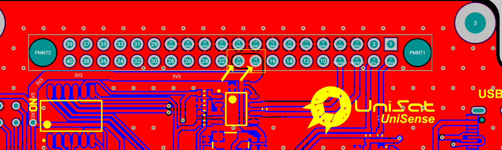
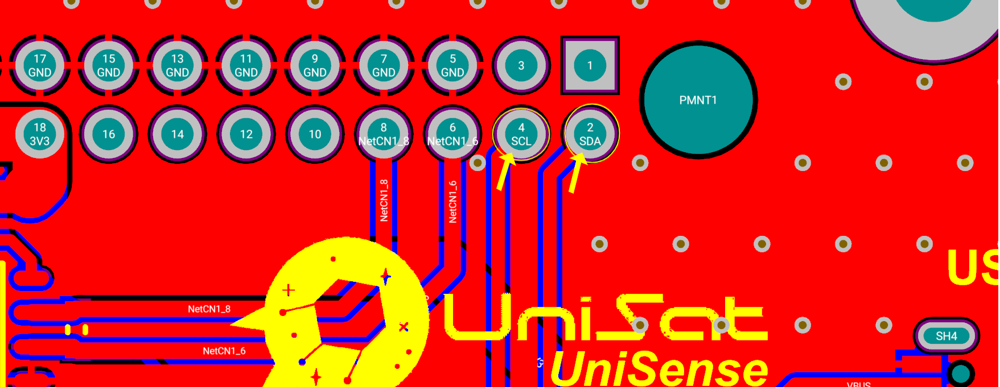
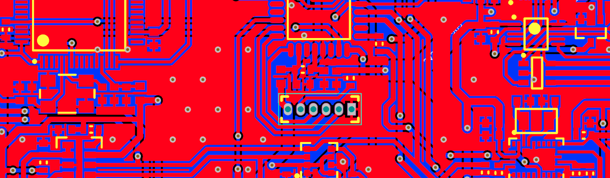
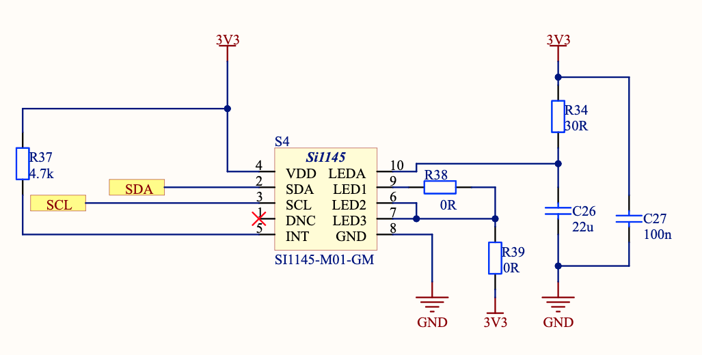
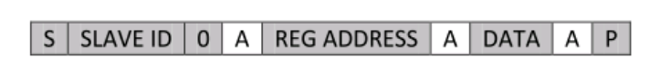
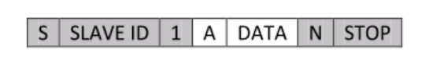
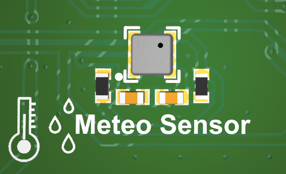

Nomidan ham ko‘rinib turibdiki, datchiklar platasi ushbu dastchiklarni o‘qish (yoki ularga javob reaktsiyasini ko‘rsatish) uchun javob beradigan qism hisoblanadi.

Izoh: Yaxshi tushunib olishingiz va tajriba orttirishingiz uchun, iltimos, foydali bo‘lishi mumkin bo‘lgan va UniSat bosma platalari bo‘yicha oxirgi ishlanmalardan xabari bor [Online 3D Viewer of SB](https://unepg.github.io/unisat/) dasturidan foydalanish imkoniyatini ko‘rib chiqing.

## SB uskunasining obzori 

<p align="center">
    
  <p align="center"><i>Unisat sensorli platasi (3D)</i></p>
</p>


Tasvirda ko‘rib turganingizday, SB bir nechta asosiy qismlarni va komponentlarni o‘z ichiga oladi, bular:

- UniSat BUS-simlarni ulash (40 pin ulagich)
- 6ta tuguning kommutatsiya qurilmasi
- STM32L0
- Arduino Pro Mini 3V protssesor
- SI1145 
- BME680 Sensori
- BNO055 Sensori
- Geiger hisoblagichi
- USB-C ulagich (Arduino bilan dasturlash uchun PCdan)
- 4 kontakning USB ulagich
- 4 kontaktning i2c ulagich

Bizda OBC dagi kabi 40 kontaktli tirqish bo‘lsa-da, ular SB da biroz boshqacha ulangan.

Biz OBCni elektr bilan 10-kontakt va 12-kontakt (1-kanal) orqali ta’minlagandik, SBni esa, suratda ko‘rsatilganiday, elektr bilan 18-kontakt va 20-kontakt (3-kanal) yordamida ta’minlaymiz:

<p align="center">
    
  <p align="center"><i>40 kontaktli tirqishdagi 3-kanal SB’ning elektr ta’minoti uchun foydalaniladi </i></p>
</p>

2-kontakt (SDA) va 4-kontakt (SCL), quyida ko‘rsatilganiday, i2c ning shinaga ulanishini ta’minlash uchun foydalaniladi (keyin u odatda OBC’dagi Rpi’ga ulanadi va foydalaniladi):

<p align="center">
    
  <p align="center"><i> SB’dagi 2C liniyalari</i></p>
</p>


Kichik tizimlarni bir-biriga ulash uchun foydalaniladigan RS485 kontaktlari SB’ga ulangan oxirgi ikkita muhim kontakt hisoblanadi:

<p align="center">
    
  <p align="center"><i> RS485 lines on the SB</i></p>
</p>


## MCU на SB

### STM32

Bizda UniSat SB’da ikkita turli MCU bor, bu STM32 va Arduino, siz ularning ikkalasini ham yoki turli vaqtlarda turli vazifalar uchun ham qo‘llashingiz mumkin.

SB’dagi STM32 - bu STM32L073RZT6. U ST mikrokontrollerlaridan Cortex®-M0+ bazasidagi o‘ta kam quvvatli 32-razryadli ARM® mikrokontrolleri.

STM32 on SB o‘ziga xos xususiyatlari:

- Ultra past quvvatli platforma

- Core: Arm® 32-bit Cortex®-M0+ с MPU protsessor 

- 192-Kbyte Flash-xotira ECC bilan

- 20-Kbyte RAM (Operatsionlik xotira)

- 6 Kbytes ma'lumotlarni EEPROM ECC bilan

- 20-bytning zaxira registr

- Sektorni R/W operatsiyalaridan himoya qilish

- USART qo'llab-quvvatlash (RS485-simlar ulangan)

- Seriyali ulanish qo'llab-quvvatlanadi

  <p align="center">
      
    <p align="center"><i>SB dagi ketma-ket sim tuzatuvchi pinlar</i></p>
  </p>

- 7-kanalli DMA kontrolleri (UART uchun qo‘llanadi va I2C bilan foydalanish uchun konfiguratsiyalanishi mumkin)

-  I2C datchiklariga va UniSat shinasiga ulangan mikrokontrollerlardan I2C

- ·     11 ta taymer: 2x 4 kanalga ega 16-bitli, 2x 2 kanalga ega 16-bitli, energiya iste’moli o‘ta past bo‘lgan 1x 16-bitli taymer, 1x SysTick, 1x RTC (real time clock, real vaqt soati), 2x 16-bit basic for DAC (digital-to-analog convertor, raqamli-analogli o‘zgartirgich), and 2x watchdogs (independent/window) (soqchi taymer)

Note: Iltimos UniSat uchun “dasturiy ta’minotni ishlab chiqish” kursining STM32 qismiga murojaat qiling.

### Arduino

SB’da Arduino – bu 8 bitli 20 MGts 32KB (16K x 16) FLASH 32-TQFP (7x7)) ga ega AVR IC seriyasidagi mikrokontroller.

Arduino’da platforma resurslari sezilarli darajada cheklangani sababli siz real sinovlar va parvoz missiyalari maqsadidagi o‘zingizning asosiy MCU / MPU uchun undan foydalanmasangiz ham bo‘ladi, ammo bu tizimni loyihalashtirish uchun yaxshi qurilma, chunki arduino’ni qo‘llash va o‘rganish OBC’dagi Rpi yoki SB’dagi STM32 ga qaraganda ancha oson.

SB’dagi Arduino chipining o‘ziga xos xususiyatlari:

- AVR® 8-bitli mikrokontrollerlar oilasida yuqori unumdorlik, past quvvat
- 32 x 8 umumiy maqsadli ishchi registrlar
- 16KB o'rnatilgan o'z-o'zidan dasturlashtiriladigan flesh-xotira
- 1KB EEPROM
- 2 KB ichki SRAM
- Dasturlashtiriladigan seriyali USART (simlardagi RS485 liniyalariga ulangan)
- MCU dan I2C I2C sensorlari va UniSat simlariga.

Havola: [spetsifikatsiyalar](https://ww1.microchip.com/downloads/en/DeviceDoc/ATmega48A-PA-88A-PA-168A-PA-328-P-DS-DS40002061B.pdf)

## SB'dagi datchiklar

### SI1145 – YaQINLAShISh DATChIGI / UV-nurlar / I2C INTYeRFYeYSIGA EGA IC ATROFNI YoRITISh datchigi 

Si1145/46/47 – bu kam quvvatli, aks ettirishga asoslangan infraqizil yaqinlashish datchigi, ultrabinafsha (UB) indeks va I2C raqamli interfeysiga va dasturlanadigan uzish qurilmasiga ega tashqi yoritish datchigi. 

Ushbu IC kontaktsiz sensori analogli-raqamli o‘zgartirgichni, ko‘rinadigan va infraqizil diapazonlardagi o‘rnatma o‘ta sezuvchan fotodiodlarni, raqamli signalli protsessorni va o‘n beshta tanlanadigan yoritish darajasiga ega bir, ikki yoki uchta o‘rnatma infraqizil diod chiroqli drayverni o‘z ichiga oladi. 

Si1145/46/47 keng dinamik diapazonda va turli yorug‘lik manbalarida, shu jumladan to‘g‘ridan-to‘g‘ri quyosh nurlarida ajoyib unumdorlikni ta’minlaydi.

#### Pin Maqsadlari

<p align="center">
    
  <p align="center"><i>pinning topshiriqlari SI1145da</i></p>
</p>


#### SB’dagi joylashuvi

<p align="center">
    
  <p align="center"><i> SI1145 Sxemalar </i></p>
</p>


#### Atrofdagi yorug‘lik

Si1145/46/47 ham ko‘zga ko‘rinadigan, ham infraqizil yorug‘likni o‘lchashga qodir bo‘lgan fotodiodlarga ega. Biroq ko‘rinadigan spektr fotodiodiga infraqizil nurlar ham ta’sir ko‘rsatadi (UniSat USK’da IQ sifatida belgilangan).

Yorug‘lik darajasini o‘lchash inson ko‘ziniki kabi spektral javobni talab qiladi. Agar lyukslarda (yorug‘lik birligi) aniq o‘lchash zarur bo‘lsa, ko‘zga ko‘rinadigan yorug‘lik fotodiodining qo‘shimcha IQ (infraqizil) javobini kompensatsiyalash lozim. Shu bois xostga infraqizil yorug‘lik ta’siriga o‘zgartirish kiritish imkonini berish uchun Si1145/46/47  alohida kanal orqali infraqizil yorug‘lik o‘lchanishi haqida xabar beradi. Alohida ko‘rinadigan va IQ-fotodiodlar turli algoritmik yechimlarni qo‘llaydi. Keyin xost bu ikki o‘lchovni olishi va inson ko‘zi qabul qiladigan ekvivalant lyuks darajasiga ega bo‘lish uchun algoritmni ishga tushirishi mumkin. Xostda ishlaydigan IQni o‘zgartirish algoritmining mavjudligi tizimga bog‘liq bo‘lgan o‘zgaruvchilarning sozlanmasida qayishqoqlikni ta’minlaydi. Masalan, agar tizimda qo‘llanadigan shisha ko‘rinadigan yorug‘likni infraqizil yorug‘likdan ko‘ra ko‘proq to‘sib qo‘ysa, IQni o‘zgartirish tizimiga o‘zgartirish kiritish kerak.  

#### Ultraviolet (UV) Index

- UVI – bu UB-nurlanish darajasining o‘lchami hisoblanadi.
- Indeks qiymatlari noldan yuqoriga o‘zgarib turadi – UVI qancha yuqori bo‘lsa, teri va ko‘zlar shikastlanishi ehtimoli shunchalik katta bo‘ladi va zarar yetkazish uchug shuncha kam vaqt talab qilinadi.
- UVI odamlarni quyoshdan himoyani ishlatish zarurati haqida ogohlantirish uchun muhim vosita hisoblanadi

> Butun dunyodagi oq tanli aholi guruhi orasida teri saratoni bilan kasallanish holatlarining sezilarli darajada oshishi quyoshdan keladigan ultrabinafsha nurlarning va, ehtimol, solyariy kabi sun’iy manbalarda olinadigan nurlarning haddan tashqari katta ta’siri bilan chambarchas bog‘liq. Hozirgi ma’lumotlar quyosh ta’siriga nisbatan shaxsiy odatlar ultrabinafsha nurlardan shikastlanish xavfining muhim individual omili hisoblanishidan dalolat bermoqda.
>
> UB-indeks jamoatchilikning ultrabinafsha nurlarning haddan tashqari ta’sirining xatarlari haqidagi xabardorligini oshirishda hamda odamlarni himoya choralarini ko‘rish zarurati haqida ogohlantirishda muhim vosita hisoblanadi.  Xalqaro sa’y-harakatlar doirasida UB-indeksi Jahon sog‘liqni saqlash tashkiloti, BMTning atrof-muhit bo‘yicha dasturi va Jahon meteorologiya tashkiloti tomonidan ishlab chiqilgan. Odamlarning quyosh ta’siridan himoyalanishini rahbatlantirish sog‘liqqa bo‘lgan zararli ta’sirni kamaytirishi va sog‘liqni saqlashga sarflanadigan harajatlarni sezilarli darajada qisqartirishi mumkin.

– Jahon sogʻliqni saqlash tashkilotidan (JSST) 

<p align="center">
    
  <p align="center"><i>UV indeksi (JSSTdan olingan)</i></p>
</p>


SI1145 on SB – Odatda uchta qiymatni yuboradi: 

- vis – ko‘rinadigan yorug‘lik
- ir – infera yorug‘lik
- `uv` - UB-indeks

Olingan qiymatlarga misollar (as json from UDC CC) :

```json
{
  "id": 8,
  "updated": "2021-11-05T14:33:26.119497",
  "vis": 0,
  "ir": 253,
  "uv": 2
}
```

####  I2C Interfeys

Slave manzil Si1145 I2C **— 0x60.** Shuningdek Si1145/46/47 global manzilga (0x00) va global tashlash (0x06) komandasiga ham javob beradi. Faqat 7 bitli I2C-adresatsiya quvvatlanadi, 10 bitli  I2C-adresatsiya quvvatlanmaydi. I2C interfeysi kontseptual tarzda Si1145/46/47 ichki registrlariga kirishga ruxsat beradi.


<p align='center'><i>I2C Bit vaqt diagrammasi </i></p>

I2C ga yozishdan foydalanish har doim ishga tushirish (yoki qayta ishga tushirish) shartidan boshlanadi. I2C manzil va o‘qish-yozish biti ishga tushirish shartidan keyin birinchi bayt hisoblanadi. Ikkinchi bayt Si1145/46/47 ichki reestrining boshlang‘ich manzilini ko‘rsatadi. Keyingi baytlar Si1145/46/47 ichki registriga to‘xtash garti yuzaga kelmaguncha ketma-ket yoziladi. Bor-yo‘g‘i ikki baytli I2C yozuvidan foydalanish odatda I2C ni o‘qishga tayyorgarlik ko‘rganda Si1145/46/47 ichki manzilini sozlash uchun foydalaniladi.

<p align="center">
    
  <p align="center"><i>Интерфейс Хоста с одной записью</i></p>
</p>


I2C ni o‘qish imkoniyati I2C ga yozish imkoniyati kabi ishga tushirish yoki qayta ishga tushirish shartidan boshlanadi.  I2C ni o‘qiganda Si1145/46/47  ga I2C ni registrning ichki tarkibi bilan boshqarish imkonini berish uchun I2C master SCK taktli chastotada davom etadi. Shuningdek Si1145/46/47 paketli o‘qish operatsiyalarini va paketli yozuvlarni quvvatlaydi. Paketli o‘qish yonma-yon, ketma-ket turgan registers’ni to‘plash uchun foydali. Si1145/46/47 registrlar kartasi uzilishlarga ishlov beruvchilar uchun paketli o‘qishni optimallashtirish maqsadida ishlab chiqilgan, paketli yozuvlar esa tez-tez foydalaniladigan satrlarni tez dasturlashni yengillashtirish uchun mo‘ljallangan.

<p align="center">
    
  <p align="center"><i>Интерфейс хоста для одного чтения</i></p>
</p>


Qaydnoma: 

- Kulrang qutilar uy egasi tomonidan Si1145 ga olib boriladi
- Oq qutilar Si1145 tomonidan uy egasiga olib boriladi
- A = ACK yoki "tasdiqlash"
- N = NACK yoki “tasdiqlanmaydi”
- S = START holati
- Sr = START holatini takrorlang 
- P =  STOP


### BME680 - nisbiy namlikni, barometrik bosimni, atrof-muhit haroratini va gazni o‘lchaydigan gazli datchik (VOC).

BME680 bu yuqori liniyalikka va aniqlikka ega bo‘lgan gaz, bosim, namlik va harorat datchiklarini birlashtirgan gazli datchik.

Bizning holatda SB’dagi BME680 harorat, bosim va namlik ko‘rsatkichlarining asosiy manbai sifatida ishlaydi.

SB’dagi BME680  datchiklar o‘rtasida joylashgan va I2C interfeysi orqali I2C shinaga va mikrokontrollerlarga ulangan.

<p align="center">
    
  <p align="center"><i>BME680 в SB</i></p>
</p>

Bosma platada “meteodatchik” (`meteo sensor`) sifatida belgilangan, u juda kichkina, ammo kuchli.  

```json
{
  "id": 22,
  "updated": "2021-11-05T14:33:12.284962",
  "temperature": 30.42,
  "pressure": 935.33,
  "humidity": 8.6
}
```

### BNO055 – akselerometr, giroskop, magnitometr va mo‘ljalni (kompas) o‘zida birlashtirgan intellektual datchik 

BNO055 intellektual datchigi System in Package (SiP) yechimidan iborat bo‘lib, u uch o‘qli 14 razryadli akselerometrni, yopiq konturli aniq uch o‘qli 16 razryadli giroskopni, uch o‘qli geomagnitli datchikni va  BSX3.0 FusionLib dasturiy ta’minotiga ega 32 razryadli mikrokontrollerni birlashtirgan.

UniSat’da u quyidagi ko‘rsatilganiday batafsil telemetriyani yuboradi:

```json
{
  "id": 7,
  "updated": "2021-11-05T14:33:19.170418",
  "temperature": 30,
  "acceleration": {
    "id": 7,
    "bno_id": 7,
    "x": 1.58,
    "y": 0.5,
    "z": 9.67
  },
  "magnetic": {
    "id": 7,
    "bno_id": 7,
    "x": 47.75,
    "y": -19.375,
    "z": -60.5625
  },
  "gyro": {
    "id": 7,
    "bno_id": 7,
    "x": -0.004363323129985824,
    "y": -0.003272492347489368,
    "z": -0.003272492347489368
  },
  "euler": {
    "id": 7,
    "bno_id": 7,
    "x": 0,
    "y": 0,
    "z": 0
  },
  "quaternion": {
    "id": 7,
    "bno_id": 7,
    "w": 0.0078125,
    "x": 0,
    "y": 0,
    "z": 0
  },
  "linear_acceleration": {
    "id": 7,
    "bno_id": 7,
    "x": 0,
    "y": 0,
    "z": 0
  },
  "gravity": {
    "id": 7,
    "bno_id": 7,
    "x": 0,
    "y": 0,
    "z": 0
  }
}
```

Siz BNO 055 dan ko‘plab vazifalar va ma’lumotlar tahili bo‘yicha ishlar uchun foydalanishingiz mumkin.

Biz SI1145 bo‘limida I2C interfeysidan foydalanish haqida gapirib o‘tganimiz uchun uni bu yerda qoldiramiz. Datchiklar haqida qo‘shimcha axborot olish uchun USK’da dasturiy ta’minot bo‘yicha hujjatlarga murojaat qilishingiz mumkin.

#### Geyger hisoblagichi

ПРИМЕЧАНИЕ: СЧЕТЧИК ГЕЙГЕРА БУДЕТ УСТАРЕВШИМ.

