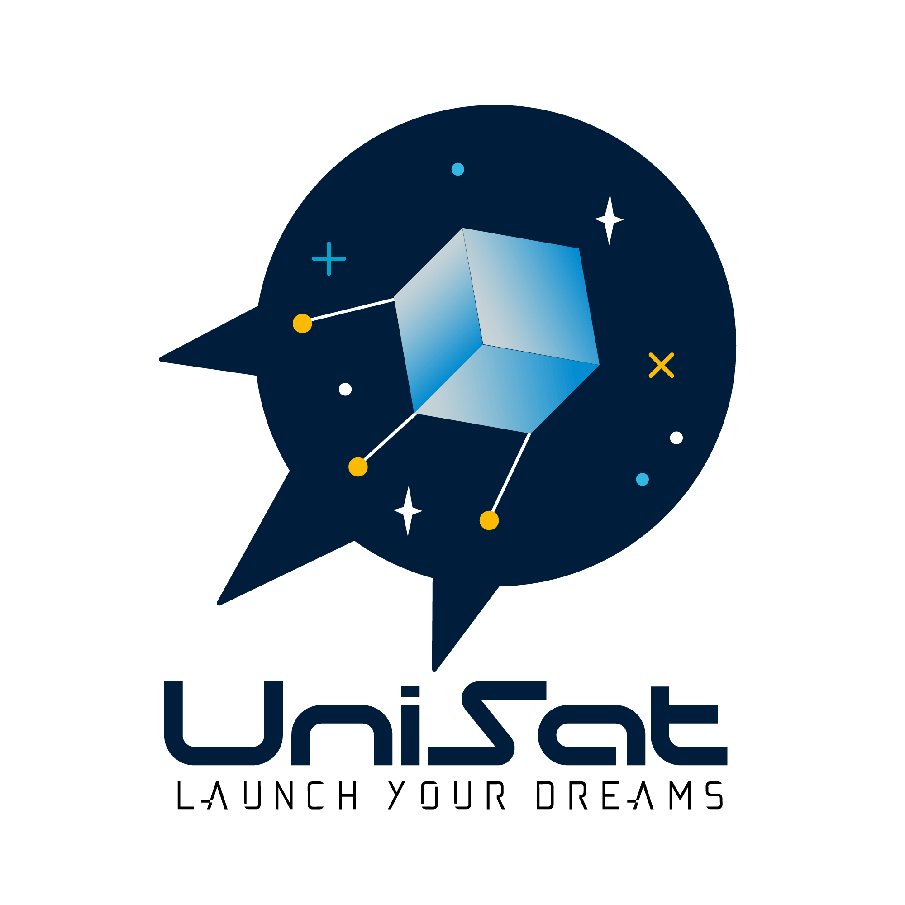
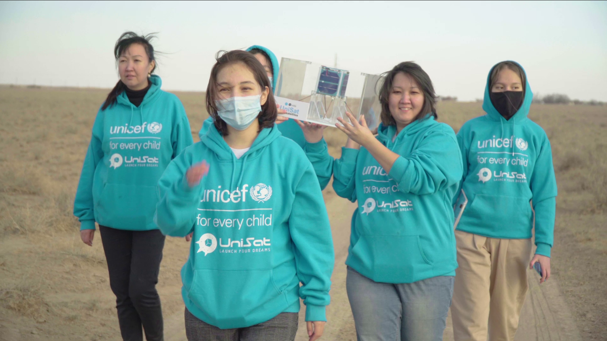

Добро пожаловать на вики unisat!

Вики UniSat также доступна на казахском, русском, узбекском и кыргызском языках.

[Official UniSat Website](https://unisat.kz)

  

  <h3 align="center">UniSat</h3>

Комплект «Unisat» и соответствующее лабораторное оборудование, комплект программного обеспечения в совокупности представляют собой сложную STEM-спутниковую платформу, предназначенную для обучения студентов основным принципам разработки, проектирования, сборки, испытаний и эксплуатации космического корабля.

[Детский фонд Организации Объединенных Наций (Unicef)] (https://unicef.org) и [Казахский национальный университет им. Аль-Фараби (КазНУ)] (https://kaznu.kz) запускают второй этап образовательного проекта по разработке **UniSat** наноспутников. Девочки от 14 до 25 лет могут подать заявку на участие в онлайн-тренинге по этой [ссылке] (https://cutt.ly/Xn2FF3y)

**UniSat** - совместная образовательная программа ЮНИСЕФ и Казахского национального университета имени аль-Фараби. В прошлом году 20 девушек разработали наноспутники и запустили их в стратосферу в рамках этой программы. Запущенные наноспутники сделали снимки Земли и собрали данные о радиации, давлении, гравитации, составе света и газа для дальнейшего анализа исследователями.

    

20 девушек из разных регионов Казахстана запустили свой нано-спутник в 2020 году

В этом году при поддержке Dubai Cares ЮНИСЕФ и КазНУ им. Аль-Фараби запустят онлайн-курс, который охватит все регионы Казахстана и обучит больше девушек. В ходе курса участники программы освоят важные этапы создания космического корабля: проектирование, проектирование, программирование, сборку, испытания и запуск.

Целью UniSat является развитие у девочек знаний и навыков в области разработки наноспутников, а также улучшение таких навыков, как командная работа, публичные выступления, управление временем и творчество.

    

    Наноспутники

**Наноспутники** - это класс малых космических аппаратов, вес которых не превышает 10 кг. Сегодня наноспутники разрабатываются в ведущих университетах мира и коммерческих организациях. Спутники UniSat предназначены для учебных целей и оснащены несколькими камерами. Одна камера снимает эллиптическое изображение Земли с разрешением 4K.

В рамках партнерства между ЮНИСЕФ и КазНУ девушки получат знания от ведущих специалистов в области аэрокосмической техники о 3D-моделировании, проектировании программных блоков управления, навыках разработки программного и аппаратного обеспечения, коммуникациях и основах программирования под Linux.

Образовательная программа **UniSat** также включает серию вебинаров успешных женщин, экспертов в различных сферах деятельности, которые поделятся своими историями успеха с участниками программы.

Лучшие выпускники онлайн-программы будут приглашены на недельный практический курс по сборке наноспутника и запуску его в стратосферу.

