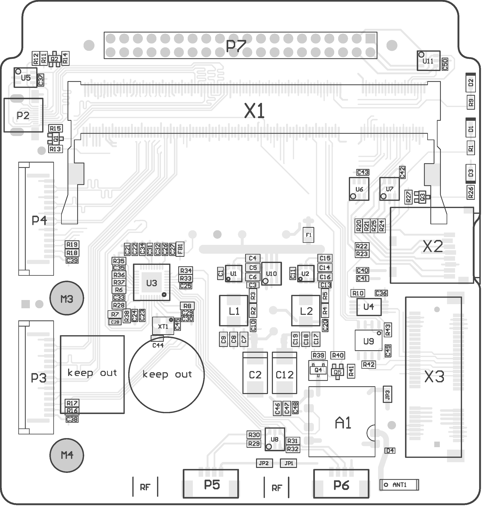
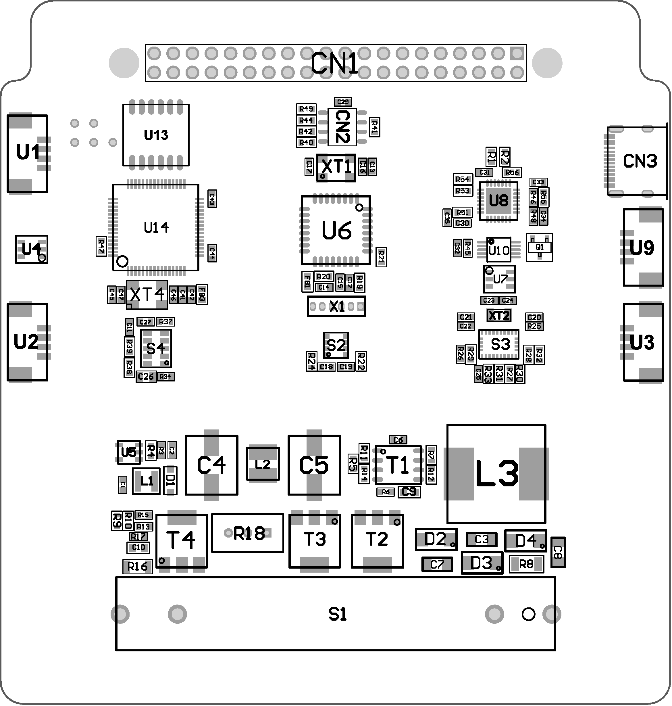

## UniSat жиынтығы 

UniSat-бұл ESA 1U стандартының арзан кубсаты, ол білім беру спутниктері үшін салалық стандарттарға сәйкес келеді, батареялармен жұмыс істейді (күн панелін қосуға және бағдарламалық түрде конфигурациялауға болады), LoRa арқылы деректерді жібереді және алады, 3D баспа жақтауы, STEM жүктеме тақтасы (SB) алдын-ала жиналған және қосымша сенсорлар мен модульдермен кеңейтілуі мүмкін.

    

<i> UniSat жиынтығы</i>

UniSat платформасы-STEM және ғылыми және инженерлік эксперименттерді оқытуға арналған аппараттық/кіріктірілген бағдарламалық жасақтама+ құралдар жиынтығы.  Әл-Фараби ғылыми паркі  ұйымдастырған қыздарға арналған наноспутниктік білім беру бағдарламасының бөлімшесін [ЮНИСЕФ қазақтары](http://unicef.org )  қаржыландырады ,ол бағдарлама UniSat жиынтығына негізделген.

    

 UniSat -тың аппараттық компоненттеріне келесілер кіреді  :

1. 3D басып шығарылған спутниктік жақтау 
2. Ұшуға арналған алюминий жақтау
3. A
4. B
5. Аккумуляторға арналған зарядтағыш және зарядтау кабелі
6. Камера модульдері   x2 
7. Жер үсті станциясы
8. Антенна тақтасы 
9. STEM пайдалы жүктемесінің тақтасы   (Датчиктер  тақтасы )
10.  EPS тақтасы
11. Тақта OBC + TRX   (басқару және беру )
12.  TOP тақтасы 
13. Батарея тақтасы  (қорек көзі )
14. Антеннаның кабелі x2 (GPS + GSM + LoRa)
15. Винт x3
16. M3 x YY 
17. Ұшуға арналған сыртқы антенна (суретке симайды)
18. Қолданушы нұсқаулығы

    

<i>Яги антеннасы </i>

## OBC аппараттық құралы

    
  
<i>Макет OBC UniSat</i>

| Негізгі қуатын жеткізуші                                 | Жады                       | Физикалық интерфейстер                                       | Желілік қосылу    | Өлшемдері    |
| -------------------------------------------------------- | -------------------------- | ------------------------------------------------------------ | ----------------- | ------------ |
| Raspberry Pi CM3/CM3 Lite (4C/1,4 ГГц, 1 Гб жедел жады ) | 4 Гб eMMC 64 Гб MicroSD/TF | - USB2.0 — 2  - RS485 — 1  - I2C — 1  - CSI — 2  - UART — 1* | WiFi 802.11 b\g\n | `10*10*0.46` |

- Процессор: BCM2837
- Процессордағы ядро саны : 4
- Процессордың архитектурасы : ARM
- Процессордың ядросы: ARMv8
- Жедел жады: 1Гб
- Жады : 64 Гб microSD
- Энергияға тәуелсіз жад : 64 Кбит
- Сымсыз  интерфейс: Wi-Fi
-  USB интерфейстер саны:  2
- Камера интерфейстерінің жалпы саны: 2 CSI
- Құрылғыны қосу үшін қажетті интерфейс : mini-PCI
- Аппараттық құрылғылармен байланысуға арналған электр интерфейстері: I2C и RS485

##  SB аппараттық құрылғысы 

SB, STEM ол тақтаның пайдалы жүктемесі

    
  
<i>Макет SB UniSat</i>

SB-дегі негізгі бөліктер :

| Аты              | Типі                               | Сипаттамасы                                                  |
| ---------------- | ---------------------------------- | ------------------------------------------------------------ |
| STM32L073RZT6    | Микроконтроллер                    | ARM® Cortex®-M0+негізіндегі ультра төмен 32 биттік микроконтроллер |
| Atmega 328P      | Микроконтроллер                    | AVR RISC архитектурасына негізделген жоғары өнімді 8 биттік төмен қуатты микроконтроллер. |
| BME680           | Датчиктер бірігуінің интегралдануы | Орнатылған жоғары сызықты және жоғары дәлдіктегі газ, қысым, ылғалдылық және температура сенсорлары. |
| BNO055           | Датчиктер бірігуінің интегралдануы | Пакеттік жүйе (SIP) үш осьті 14 биттік акселерометрді, дәл үш осьті 16 биттік жабық гироскопты, үш осьті геомагниттік сенсорды және 32 биттік микроконтроллерді біріктіретін шешім |
| SI1145           | Датчик                             | УК /ИҚ/көрінетін жарықтың  индексінің сандық сенсоры         |
| Счетчик Гейгера* | Датчик                             | Иондаушы сәулеленуді анықтау және өлшеу блогы                |
| SDS011*          | Унифицияланған Датчик              | Чипте 8 биттік процессоры бар PM2.5/PM10 ауа сапасының сенсоры. |

### STM32L073RZT6

    
  
<i>SB-дағы STM32L073RZT6  (сурет алынды : Электрондық компоненттер )</i>

ARM® Cortex®сериялы микроконтроллер микросызбасы -M0+ 32 биттік 32 МГц 192 КБ (192 К x8) флэш-жад 64-QFP (10x10)

#### SB-дағы артықшылықтары 

- Өте төмен қуатты платформа
- Ядро: Arm **32-бит  Cortex-M0**+  MPU-мен бірге 
  - 32 кГц -ден максимум 32 МГц  -дейін .
  - 0.95 DMIPS/MГц
- Жад
  - Ecc-мен 192 Кбайтқа дейінгі Флэш-жад (жазу кезінде оқу мүмкіндігі бар 2 банк бар )
  - Көлемі 20 Кбайт жедел жады
  - ECC-мен  6 Кбайт EEPROM деректері
  - 20 байттық резервтік регистр
  - Секторды R / W-операцияларынан қорғау
- 84 жылдам кірістер/шығыстар  (78 кіріс / шығыс 5 В -қа төзімділікте)
- Тактілік импульстер көзі
  - RC (+/- 1%)зауыттық әрлеуімен жоғары жылдамдықты ішкі 16 МГц-ті
- Бағдарламаланған жүктеуші
  - USB, **USART-ты қолдайды ** ***(USART  тек SB-да ғана )***
- Дамуды қолдау
  - **Сериялық сымды жөндеуге **  қолдау көрсетіледі

- Сенсорлық пернелерді, сызықты және айналмалы  сенсорларды қолдайтын   24 сыйымды сенсорлық арналарға дейін болады 
- 7-арналы   **DMA контроллері  **,  ADC, SPI, **I2C**, **USART**, DAC, Tаймерлерді қолдайды   ***(I2C және   SB-дағы USART)***
- 11x перифериялық байланыс интерфейстері
  - **4x USART** (2 с ISO 7816, IrDA), 1x UART (төмен қуатты  )
  - **3x I2C** (2 с SMBus/PMBus)

### BME680

| Ерекшелігі                      | Сипаттамасы                                                  |
| ------------------------------- | ------------------------------------------------------------ |
| Жұмыс диапазоны  (толық дәлдік) | Қысым : 300...1100 ГПа Ылғалдылық 0...100% Температура: -40...85°C |
| Интерфейс                       | I²C                                                          |
| Орташа ток тұтыну               | Ылғалдылық 1 Гц, қысым және  температура кезінде 3,7 мкА     |

##  TRX Құрылғысы 

##  EPS Құрылғысы 

##  TOP Құрылғысы

##  AN Құрылғысы

## BB Құрылғысы

