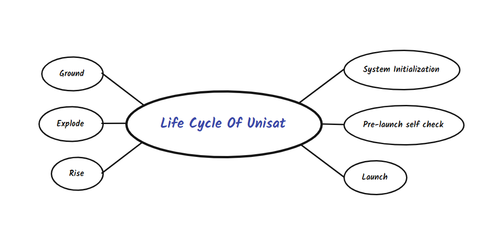
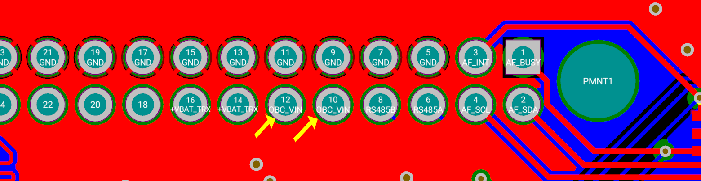
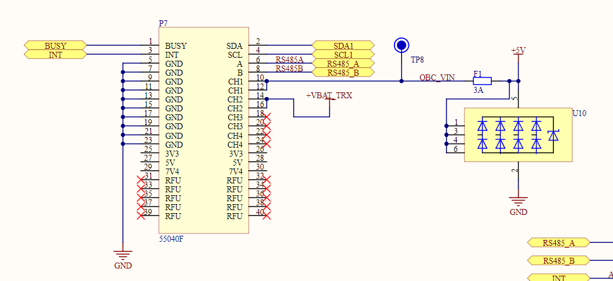
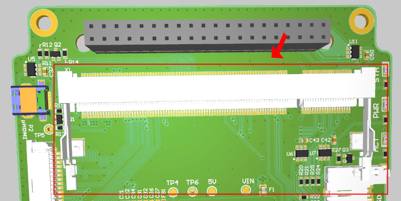
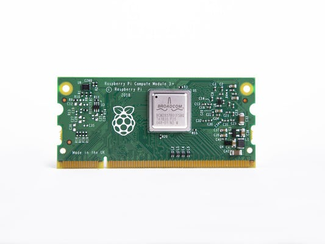

## Кіріспе

Ескерту: Сіз жақсы түсіну және тәжірибе алу үшін [OBC 3D  онлайн қараңыз](https://unepg.github.io/unisat /), бұл өте пайдалы және әрқашан UniSat -тың  соңғы платасының әзірлемелерінен хабардар бола аласыз.


<p align="center">
    
  <p align="center"><i>UniSat</i></p>
</p>
Борттық компьютер (бұдан әрі-OBC деп аталады) ғарыш аппаратының ажырамас бөлігі, сондай-ақ UniSat негізгі есептеу блогы болып табылады. Негізгі жүктеме OBC-ге түседі және барлық түйіндер мен ішкі жүйелер борттық компьютерге енгізілген   алгоритмдермен орындалуы ,басқарылуы керек. Білім беруде қолдану үшін борттық компьютер интерактивті анықтамалық құжат немесе кітап, әзірлеу  ортасы және басқа ішкі жүйелер үшін байланыс орталығы функцияларын орындауы керек.

Сонымен қатар, борттық компьютер (OBC) жүйелік деректерді жинау, журнал жүргізу, қателерді өңдеу, деректерді бақылау және т. б. сияқты барлық негізгі функцияларға жауап беретін спутниктің негізгі миы болып табылады.

Мұнда OBC - де екі камера бар, олардың бірі-әдемі ғарыштық суреттерді түсіруге жауап беретін жалпы RPi камерасы, ал екіншісі бейне жазбаларға жауап береді.

Түсіру міндеті (суреттер де, бейнежазбалар да ) - бұл циклдік кезеңде спутниктің бүкіл қызмет ету мерзімінде орындалатын бағдарламалық жасақтама жасаған тапсырма.

<p align="center">
    
  <p align="center"><i> Unisat өмірлік циклі</i></p>
</p>

Бұл құжатта біз барлық негізгі OBC аппараттық компоненттерін бір-бірлеп таныстырамыз.

##  UniSat Шинасы  (40 істікше)

UniSat ішкі жүйесінің әр аппараттық құралында байқайтын бірінші нәрсе-40 істікшелі Шинасы. Осылайша UniSat ішкі жүйелері бір-бірімен өзара әрекеттеседі және олардан энергия алады.

<p align="center">
    
  <p align="center"><i>40 істікшелі шина барлық ішкі жүйелерді қосады</i></p>
</p>

40 контактінің барлығы OBC-ге қосылмаған, біз оны [баспа платасынан](https://unepg.github.io/unisat/obc.html)  анық көре аламыз.

<p align="center">
    
  <p align="center"><i> RS485 A/B  сызықтары</i></p>
</p>

Көріп отырғаныңыздай, 6-шы шығыс (RS485A) және 8-ші шығыс (RS485B) параллель қосылған және оларды әр баспа платасында табуға болады, оны кейінірек егжей-тегжейлі талқылаймыз, олар негізінен әртүрлі ішкі жүйелер арасындағы байланыс үшін қолданылады.

<p align="center">
    
  <p align="center"><i>I2C сызықтары </i></p>
</p>

Сондай-ақ, сіз екі байланыс атауын таба аласыз, өйткені SDA (2-ші шығыс) және SCL (4-ші шығыс) OBC-ге қосылған. Осы екі жолды пайдалану датчиктер тақтасындағы сенсорларды тікелей өзара әрекеттесуге және басқаруға мүмкіндік береді (өйткені бізде OBC-де ресурстар жеткілікті және Linux құрылғысында сенсорларды бағдарламалау оңайырақ болады).

<p align="center">
    
  <p align="center"><i> ОВС Power сызықтары </i></p>
</p>

10 және 12 шығыс  EPS- тен OBC-ді қамтамасыз етеді.

<p align="center">
    
  <p align="center"><i> OBC `Busy` істікшесі </i></p>
</p>

Сондай-ақ, бізде OBC-ге қосылған Busy істікшесі  (pin 1) бар, ол негізінен байланыс үшін қолданылады, оны кейінірек егжей-тегжейлі талқылаймыз.

Міне, 40 істікшелі шинаның толық кестесі:

| RFU  | RFU  | RFU  | 7V4  | 5V   | 3V3  | GND  | GND  | GND  | GND  | GND  | GND  | GND  | GND  | **GND**  | **GND**  | GND         | GND          | INT         | BUSY        |
| ---- | ---- | ---- | ---- | ---- | ---- | ---- | ---- | ---- | ---- | ---- | ---- | ---- | ---- | -------- | -------- | ----------- | ------------ | ----------- | ----------- |
| 39   | 37   | 35   | 33   | 31   | 29   | 27   | 25   | 23   | 21   | 19   | 17   | 15   | 13   | 11       | 9        | 7           | 5            | **3**       | **1**       |
| 40   | 38   | 36   | 34   | 32   | 30   | 28   | 26   | 24   | 22   | 20   | 18   | 16   | 14   | 12       | 10       | 8           | 6            | 4           | 2           |
| RFU  | RFU  | RFU  | 7V4  | 5V   | 3V3  | CH 5 | CH 5 | CH 4 | CH 4 | CH 3 | CH 3 | CH 2 | CH 2 | **CH 1** | **CH 1** | **RS485 B** | **RS485  A** | **I2C SCL** | **I2C SDA** |

Келесі суретте Шинаның электрлік сызбасы көрсетілген:

<p align="center">
    
  <p align="center"><i> UniSat Шинасының схемасы </i></p>
</p>


##  RPi CM3L және SODIMM қосқыштары  

OBC баспа тақтасында  оңай көруге болатын үлкен қосқыш-бұл Raspberry Pi 3+ Lite (немесе RPI CM3L) есептеу модулін қосуға арналған `SODIMM` қосқышы.

<p align="center">
    
  <p align="center"><i> OBC-дағы SODIMM қосқыш</i></p>
</p>

Raspberry Pi 3+ (CM3+) есептеу модулі-бұл DDR2 - SODIMM-механикалық үйлесімді модульдер жүйесі , құрамында процессор, жад, eMMC флэш-жады (Lite-тен басқа нұсқаларда) және қуат схемалары бар.[1] Бұл модульдер әзірлеушіге Raspberry Pi аппараттық және бағдарламалық стектерін өздерінің жеке жүйелерінде және форма факторларында пайдалануға мүмкіндік береді. Сол себепті біз оны UniSat-тағы негізгі есептеу ресурсы ретінде қолданамыз. 

CM3 + құрамында BCM2837B0 процессоры бар (Raspberry Pi 3B+ ретінде қолданылады), 1 Гб LPDDR2 жедел жады және eMMC флэш-жады бар. CM3 + қазіргі уақытта 4 нұсқада қол жетімді: CM3+/8 ГБ, CM3+/16 ГБ,CM3+/32 ГБ және CM3+ Lite, олар 8, 16 және 32 гигабайт eMMC флэш-жадына ие немесе eMMC флэш-жадына ие емес .

UniSat сияқты жүйе үшін 32 ГБ бос орын жеткіліксіз болып көрінуі мүмкін және бізге жеңіл нұсқаны пайдалану және eMMC флэш-жадына SD картасын ауыстыру арқылы қосымша кеңейту мүмкіндігі қажет.

Осылайша сіз Rpi дискі үшін  кез-келген  сыйымдылықты еркін қолдана және таңдай аласыз.


<p align="center">
    
  <p align="center"><i> ОВС-дағы CM3+L</i></p>
</p>


###  RPi CM3/CM3+ Ерекшеліктері  

#### Құрылғы

-  2x I2C (біреуі ОВС -де екі камераны басқару үшін қолданылады, ал екіншісі тақтадан мәліметтер алу үшін шинадағы I2C желілеріне қосылған)
-  1x 4 полюсті CSI камера интерфейсі (бір жолаққа 1 Гбит/с дейін) (0 камерасын OBС-ға қосу үшін қолданылады)
-  1x 2 полюсті CSI камера интерфейсі (бір жолаққа 1 Гбит/с дейін) (1 камераны ОBC-ке қосу үшін қолданылады)
-  2X UART (өйткені RPi-дегі UART-тың біреуі CM3-те қолдануға өте ыңғайлы және ол алдымен UniSat шинасындағы RS A/B желілеріне қосылады)
-  2X SD/SDIO (OBC-де SD картасының интерфейсіне қосылған)
-  1x HDMI 1.3 a (OBC-де Micro HDMI интерфейсіне қосылған)
- 1x USB 2 ХОСТ/OTG (USB концентраторына қосылған, содан кейін ол 4 істікшелі USB коннекторларына және ОBC-дегі Wi-Fi модуліне қосылған)

#### Бағдарламалық қамтамасыз ету

-  ARMv8 нұсқаулықтары жинағы 
- Дамыған және тұрақталған Linux стегі
  - Linux  ядросының жаңартылған түрі
  - Many drivers upstreamed
  - Тұрақты және жақсы қолдау көрсетілетін пайдаланушы ортасы
  - Стандартты API көмегімен GPU мүмкіндіктерінің толық қол жетімділігі
  - Спутник үшін Debian негізіндегі тұрақты ОS

####  CM3 блок диаграммасы 


CM3-те 200 контактілер бар, олар SODIMM DDR2 (1,8 В) модульдері арқылы қол жетімді (бірақ олардың барлығы баспа платасына  қосылмаған) және келесі схемада көрсетілгендей қосылған :


#### OBC UniSat-тағы СМ3-тің шығыстарының маңызды қолданыстары.

| Істікше | Функциясы | Тоқтату    | Сипаттамасы         |
| ------- | --------- | ---------- | ------------------- |
| 0       | input     | pull_up    | *CAMERA 1 I2C0 SDA* |
| 1       | input     | pull_up    | *CAMERA 1 I2C0 SCL* |
| 2       | input     | pull_up    | *SMPS_SCL*          |
| 3       | input     | pull_up    | *SMPS_SDA*          |
| 14      | uart0     | no_pulling | *TX uart0*          |
| 15      | uart0     | pull_up    | *RX uart0*          |
| 28      | input     | pull_up    | *CAMERA 0 I2C0 SDA* |
| 29      | input     | pull_up    | *CAMERA 0 I2C0 SCL* |
| 36      | output    | pull_up    | *WIFI DIS*          |
| 40      | output    | pull_up    | *HAB RESET*         |
| 46      | input     | no_pulling | *Hot-plug*          |
| 47      | output    | no_pulling | *EMMC_ENABLE_N*     |
| 48      | sdcard    | pull_up    | *SD CLK*            |
| 49      | sdcard    | pull_up    | *SD CMD*            |
| 50      | sdcard    | pull_up    | *SD D0*             |
| 51      | sdcard    | pull_up    | *SD D1*             |
| 52      | sdcard    | pull_up    | *SD D2*             |
| 53      | sdcard    | pull_up    | *SD D3*             |

#### OBC UniSat-да CM3-ті басқаруға арналған құрылғы көзі файлының үлгісі

```dtd
/dts-v1/;

/ {
  videocore {

    pins_cm3 {

      pin_config {

        pin@default {
          polarity = "active_high";
          termination = "pull_down";
          startup_state = "inactive";
          function = "input";
        }; // pin

        pin@p0  { function = "input";  	termination = "pull_up";    }; // CAMERA 1 I2C0 SDA
        pin@p1  { function = "input";  	termination = "pull_up";    }; // CAMERA 1 I2C0 SCL
		
        pin@p2 { function = "input";  	termination = "pull_up";    }; // SMPS_SCL
        pin@p3 { function = "input";  	termination = "pull_up";    }; // SMPS_SDA

        pin@p14 { function = "uart0";  	termination = "no_pulling"; drive_strength_mA = < 8 >; }; // TX uart0
        pin@p15 { function = "uart0";  	termination = "pull_up";    drive_strength_mA = < 8 >; }; // RX uart0
		
        pin@p28 { function = "input";  	termination = "pull_up";    }; // CAMERA 0 I2C0 SDA
        pin@p29 { function = "input";  	termination = "pull_up";    }; // CAMERA 0 I2C0 SCL
		
	pin@p36 { function = "output";	termination = "pull_up"; startup_state = "inactive";	}; 				// WIFI DIS
	pin@p40	{ function = "output"; 	termination = "pull_up"; polarity = "active_low"; startup_state = "inactive"; };	// HAB RESET

        pin@p42  { function = "output"; termination = "no_pulling"; }; 	// CAMERA 0 LED
        pin@p43  { function = "output"; termination = "no_pulling"; }; 	// CAMERA 0 SHUTDOWN
        pin@p44 { function = "output"; 	termination = "no_pulling"; };	// CAMERA 1 LED
        pin@p45 { function = "output"; 	termination = "no_pulling"; };	// CAMERA 1 SHUTDOWN
		
        pin@p46 { function = "input";  termination = "no_pulling"; polarity = "active_low"; }; // Hotplug
        pin@p47 { function = "output"; termination = "no_pulling"; polarity = "active_low"; }; // EMMC_ENABLE_N
	pin@p48 { function = "sdcard"; 	termination = "pull_up";    drive_strength_mA = < 8 >; }; // SD CLK
        pin@p49 { function = "sdcard"; 	termination = "pull_up";    drive_strength_mA = < 8 >; }; // SD CMD
        pin@p50 { function = "sdcard"; 	termination = "pull_up";    drive_strength_mA = < 8 >; }; // SD D0
        pin@p51 { function = "sdcard"; 	termination = "pull_up";    drive_strength_mA = < 8 >; }; // SD D1
        pin@p52 { function = "sdcard"; 	termination = "pull_up";    drive_strength_mA = < 8 >; }; // SD D2
        pin@p53 { function = "sdcard"; 	termination = "pull_up";    drive_strength_mA = < 8 >; }; // SD D3

      }; // pin_config

      pin_defines {
        pin_define@HDMI_CONTROL_ATTACHED 	{ type = "external"; number = <0>; };
        pin_define@EMMC_ENABLE 				{ type = "external"; number = <1>; };
        pin_define@POWER_LOW 				{ type = "absent"; };
        pin_define@LEDS_DISK_ACTIVITY 		{ type = "absent"; };
        pin_define@LAN_RUN 					{ type = "absent"; };
        pin_define@SMPS_SDA 				{ type = "internal"; number = <2>; };
        pin_define@SMPS_SCL 				{ type = "internal"; number = <3>; };
        pin_define@ETH_CLK 					{ type = "absent"; };
        pin_define@WL_LPO_CLK 				{ type = "absent"; };
        pin_define@USB_LIMIT_1A2 			{ type = "absent"; };
        pin_define@SIO_1V8_SEL 				{ type = "absent"; };
        pin_define@PWML 					{ type = "absent"; };
        pin_define@PWMR 					{ type = "absent"; };
        pin_define@SAFE_MODE 				{ type = "absent"; };
        pin_define@SD_CARD_DETECT 			{ type = "absent"; };
        pin_define@ID_SDA 					{ type = "absent"; };
        pin_define@ID_SCL 					{ type = "absent"; };

        pin_define@NUM_CAMERAS 				{ type = "internal"; number = <2>; };
        pin_define@CAMERA_0_LED 			{ type = "internal"; number = <42>; };
        pin_define@CAMERA_0_SHUTDOWN 		{ type = "internal"; number = <43>; };
        pin_define@CAMERA_0_UNICAM_PORT 	{ type = "internal"; number = <0>; };
        pin_define@CAMERA_0_I2C_PORT 		{ type = "internal"; number = <0>; };
        pin_define@CAMERA_0_SDA_PIN 		{ type = "internal"; number = <28>; };
        pin_define@CAMERA_0_SCL_PIN 		{ type = "internal"; number = <29>; };
        pin_define@CAMERA_1_LED 			{ type = "internal"; number = <44>; };
        pin_define@CAMERA_1_SHUTDOWN 		{ type = "internal"; number = <45>; };
        pin_define@CAMERA_1_UNICAM_PORT 	{ type = "internal"; number = <1>; };
        pin_define@CAMERA_1_I2C_PORT 		{ type = "internal"; number = <0>; };
        pin_define@CAMERA_1_SDA_PIN 		{ type = "internal"; number = <0>; };
        pin_define@CAMERA_1_SCL_PIN 		{ type = "internal"; number = <1>; };
      }; // pin_defines

    }; // pins_cm3

  };

};

```

Ескерту: OBC RPi туралы қосымша ақпарат алу үшін бағдарламалық жасақтама құжаттамасының бөліміне назар аударыңыз.

##  OBC-дағы камералар

OBC екі түрлі камера модулімен жабдықталады және олар формасымен  де, атқаратын функцияларымен де  ерекшеленеді.

#### Камера 0

OBC-ге қосылған UniSat-тағы 0 камерасы- 5 мегапиксельді 175 градустық кең бұрышты "балық көзі" объективті, Raspberry Pi OV5647 камера модулі. Ол әдетте ғарыш кемесінің төменгі жағында орналасқан, сондықтан ол ғарыштан жердің әдемі суреттерін түсіре алады.

<p align="center">
    
  <p align="center"><i>ОВС-дағы "Балық көзі"камерасы </i></p>
</p>


Камера 0-дің негізгі техникалық сипаттамалары:

- **Датчик типі: OV5647** 
- **Рұқсаттамасы:2592 x 1944**
- **Объектив: f=3.6 мм, f/2.9**
- **Көру аймағы: 175 градус**
- **Объектке дейінгі арақашықтығы:  5cм-ден  шексіздікке дейін**
- **Бейнежазбадағы кадрлар жиілігі: ** **1080p жылдамдығы 30 кадр / с H. 264 (AVC) кодекімен    (VGA-да 90 кадр / с дейінгі бейне)**
- **500 миллион пикселді**

#### Камера 1

<p align="center">
    
  <p align="center"><i>  ОВС-дағы Камера  1 </i></p>
</p>

ОBC-дегі 1-Камера-бұл raspberry pi камерасының стандартты модулі және төменде көрсетілгендей техникалық сипаттамаларға ие:

- **Sony IMX219  датчигі**
- **8-мегапикселді**
- **1080p30, 720p60 және VGA90 бейнежазба режимдерін қолдайды**

## OBC-ді басқа негізгі аппараттық компонеттері

OBC басқа қосалқы USB құрылғыларын қосуға арналған екі 4 істікшелі USB -концентраторлар, сыртқы дисплейлерге қосылу үшін Micro HDMI, TF (microSD картасы) көмегімен пайдалануға арналған microSD картасының слот сияқты басқа аппараттық компоненттермен бірге келеді. Олар туралы толық ақпарат алу үшін OBC схемалары мен баспа платасына жүгінуге болады.
